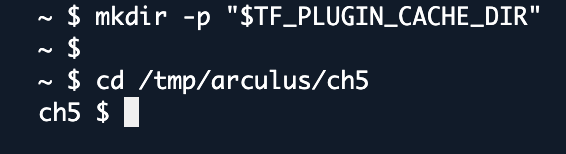
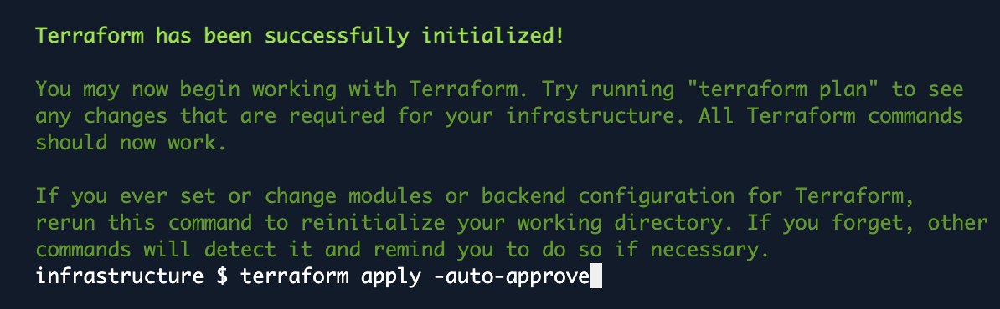
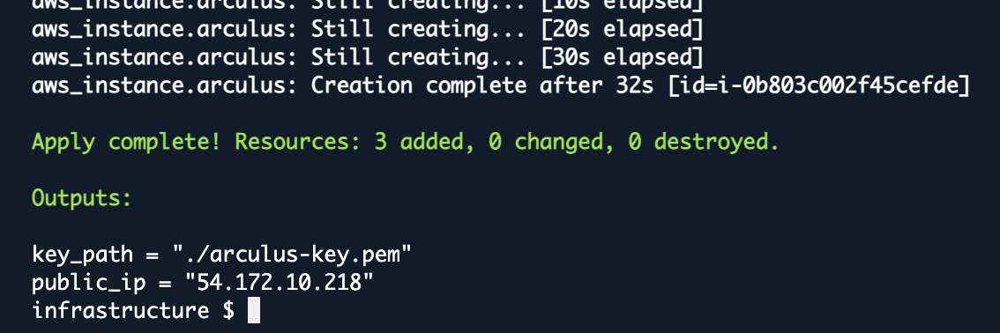
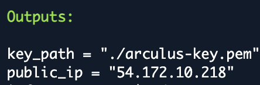
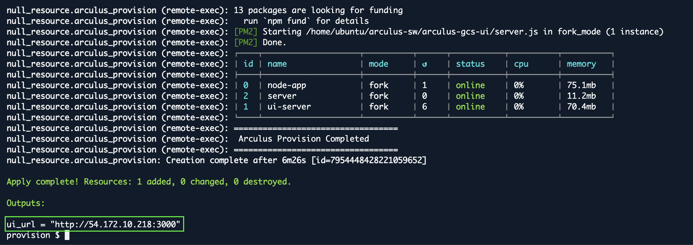
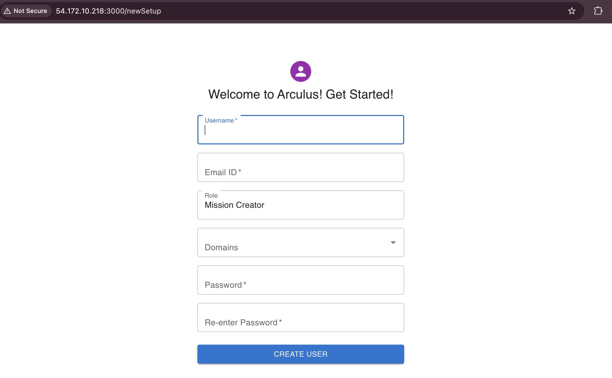
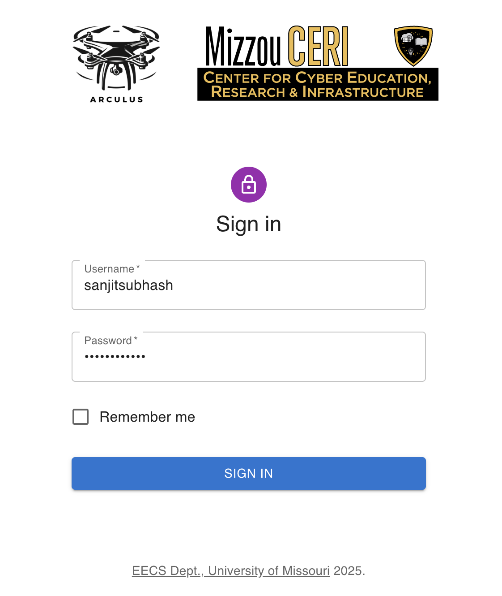
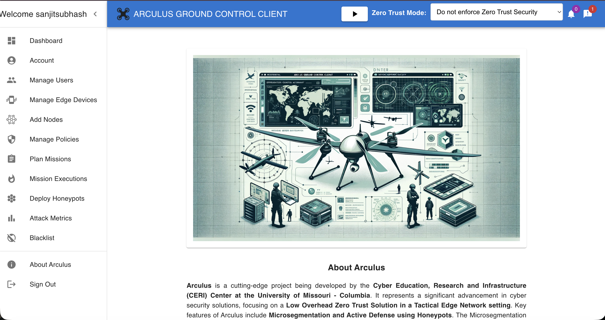

# Chapter 5 - Arculus Portal Set-Up

## 5.1 Overview

In this chapter, you will bring the Arculus Portal fully online using a combination of Terraform, automated provisioning scripts, and a set of pre-configured services that run on an Ubuntu EC2 instance. The goal of this chapter is to transition from infrastructure creation (Chapter 4) to a fully functional zero-trust portal that students can interact with through a browser.

You begin by using Terraform to deploy an Ubuntu instance, generate an SSH key pair, discover the instance’s public IP, and configure the required inbound rules. Once the instance is created, Terraform automatically connects to it and runs a provisioning script. This script installs dependencies, clones the arculus-sw repository, sets up the backend and UI services, and launches the stack using PM2. When provisioning completes successfully, Terraform outputs a browser-ready URL pointing to the Arculus web interface.

With the services running, students open the portal in a web browser and complete the first-time setup by creating their initial Arculus user. This initializes the system and unlocks the Sign-In page, where users can now log into the portal. By the end of this chapter, the Arculus policy and mission-management UI is fully operational and ready for use in later chapters.

## 5.2 CloudShell Setup (same pattern as Chapter 4)

**What this does**: Installs Terraform to /tmp, uses CloudShell role creds, stores TF state/plugins in /tmp, and prepares the chapter 5 working directory.

```bash
export AWS_REGION=${AWS_REGION:-us-east-1}

unset AWS_PROFILE AWS_SDK_LOAD_CONFIG AWS_ACCESS_KEY_ID AWS_SECRET_ACCESS_KEY AWS_SESSION_TOKEN

TF_VERSION="1.9.5"
ARCH=$(uname -m;); case "$ARCH" in x86_64) TF_ARCH="amd64" ;; aarch64) TF_ARCH="arm64" ;; *) echo "Unsupported arch: $ARCH"; exit 1;; esac
mkdir -p /tmp/bin /tmp/arculus/ch5
curl -fsSLo /tmp/terraform.zip "https://releases.hashicorp.com/terraform/${TF_VERSION}/terraform_${TF_VERSION}_linux_${TF_ARCH}.zip"
unzip -o /tmp/terraform.zip -d /tmp/bin >/dev/null
export PATH="/tmp/bin:$PATH"
terraform -version

export TF_DATA_DIR=/tmp/.tfdata
export TF_PLUGIN_CACHE_DIR=/tmp/.tfplugins
mkdir -p "$TF_PLUGIN_CACHE_DIR"

cd /tmp/arculus/ch5
```
<p align="center"> </p>


## 5.3 Write Main.tf Scripts

In this section, we will begin constructing the Terraform configuration that will deploy the core infrastructure. The goal is to help you understand where Terraform stores files, how the configuration is organized, and what the first blocks of Terraform code actually do.

### 5.3.1 Create Infrastructure Directory
```bash
mkdir infrastructure
cd infrastructure
nano main.tf
```
### 5.3.2 Edit infrastructure/main.tf script

```bash
terraform {
  required_providers {
    aws = {
      source  = "hashicorp/aws"
      version = "~> 5.0"
    }
  }
}

provider "aws" {
  region = "us-east-1"
}

# ---------- VPC + SUBNET LOOKUP ----------
data "aws_vpc" "default" {
  default = true
}

data "aws_subnets" "default" {
  filter {
    name   = "vpc-id"
    values = [data.aws_vpc.default.id]
  }
}

# ---------- KEY PAIR ----------
resource "tls_private_key" "ssh" {
  algorithm = "RSA"
  rsa_bits  = 4096
}

resource "aws_key_pair" "arculus" {
  key_name   = "arculus-key-test"     ###<--------- CHANGE THIS TO YOUR UNIQUE NAME ###############
  public_key = tls_private_key.ssh.public_key_openssh
}

resource "local_file" "private_key" {
  filename = "${path.module}/arculus-key.pem"
  content  = tls_private_key.ssh.private_key_pem
}

# ---------- SECURITY GROUP ----------
resource "aws_security_group" "arculus" {
  name   = "arculus-sg-test-network"          ###<--------- CHANGE THIS TO YOUR UNIQUE NAME ###############
  vpc_id = data.aws_vpc.default.id

  # ----- HTTP / HTTPS -----
  ingress { 
    from_port = 80 
    to_port = 80 
    protocol = "tcp" 
    cidr_blocks = ["0.0.0.0/0"] 
    }

  ingress { 
    from_port = 443 
    to_port = 443 
    protocol = "tcp" 
    cidr_blocks = ["0.0.0.0/0"] 
    }

  # ----- UI Ports -----
  ingress { 
    from_port = 3000 
    to_port = 3003 
    protocol = "tcp" 
    cidr_blocks = ["0.0.0.0/0"] 
    }
    
  # ----- Arculus Ports -----
  ingress { 
    from_port = 8440 
    to_port = 8440 
    protocol = "tcp" 
    cidr_blocks = ["0.0.0.0/0"] 
    }

  ingress { 
    from_port = 8441 
    to_port = 8441 
    protocol = "tcp" 
    cidr_blocks = ["0.0.0.0/0"] 
    }

  ingress { 
    from_port = 8442 
    to_port = 8442 
    protocol = "tcp" 
    cidr_blocks = ["0.0.0.0/0"] 
    }

  ingress { 
    from_port = 8443 
    to_port = 8443 
    protocol = "tcp" 
    cidr_blocks = ["0.0.0.0/0"] 
    }

  # ----- Kubernetes / Node Agent -----
  ingress { 
    from_port = 10250 
    to_port = 10250 
    protocol = "tcp" 
    cidr_blocks = ["0.0.0.0/0"] 
    }

  # ----- Drone UDP Ports -----
  ingress { 
    from_port = 8285 
    to_port = 8285 
    protocol = "udp" 
    cidr_blocks = ["0.0.0.0/0"] 
    }
  ingress { 
    from_port = 14550 
    to_port = 14558 
    protocol = "udp" 
    cidr_blocks = ["0.0.0.0/0"] 
    }

  # ----- BGP (Seen in screenshot) -----
  ingress { 
    from_port = 179 
    to_port = 179 
    protocol = "tcp" 
    cidr_blocks = ["0.0.0.0/0"] 
    }

  # ----- ALL TCP (because screenshot has this rule) -----
  ingress { 
    from_port = 0 
    to_port = 65535 
    protocol = "tcp" 
    cidr_blocks = ["0.0.0.0/0"] 
    }

  # ----- ALL UDP (because screenshot has this rule) -----
  ingress { 
    from_port = 0 
    to_port = 65535 
    protocol = "udp" 
    cidr_blocks = ["0.0.0.0/0"] 
    }

  # ----- SSH (CloudShell + global) -----
  ingress { 
    from_port = 22 
    to_port = 22 
    protocol = "tcp" 
    cidr_blocks = ["3.230.143.85/32"] 
    }

  ingress { 
    from_port = 22 
    to_port = 22 
    protocol = "tcp" 
    cidr_blocks = ["0.0.0.0/0"] 
    }

  # ----- Outbound -----
  egress {
    from_port   = 0
    to_port     = 0
    protocol    = "-1"
    cidr_blocks = ["0.0.0.0/0"]
  }
}

# ---------- EC2 INSTANCE ----------
resource "aws_instance" "arculus" {
  ami                         = "ami-034003b238ddb708b"
  instance_type               = "t2.large"
  subnet_id                   = data.aws_subnets.default.ids[0]
  vpc_security_group_ids      = [aws_security_group.arculus.id]
  associate_public_ip_address = true
  key_name                    = aws_key_pair.arculus.key_name

  tags = {
    Name = "arculus-final-instance-sanjittest2" ## Make 
  }
}

# ---------- OUTPUTS ----------
output "public_ip" {
  value = aws_instance.arculus.public_ip
}

output "key_path" {
  value = "${path.module}/arculus-key.pem"
}


```

### 5.3.3 Run infrastructure script
```bash
terraform init
terraform apply -auto-approve
```

<p align="center"> </p>
<p align="center"> </p>

After Terraform finishes creating your EC2 instance, it will display an "Outputs" section that includes the ``public_ip`` of your server.

**Copy this IP address and save it somewhere safe (Notes app, text file, etc.).**

**You will need this IP address in the upcoming steps to:**

* connect to your instance

* configure your security groups

* run provisioning scripts

* access the browser-based UI later in the chapter

If you lose it, you will have to run terraform output again or check the EC2 console—so it’s easier to store it now.

<p align="center"> </p>

### 5.3.4 Create Provision Directory

```bash
cd ..
mkdir provision
cd provision
nano main.tf
```
### 5.3.5 Paste the following into provision/main.tf script

```bash
terraform {
  required_providers {
    null = {
      source  = "hashicorp/null"
      version = "~> 3.2"
    }
  }
}

variable "public_ip" {
  type = string
}

resource "null_resource" "arculus_provision" {

  connection {
    type        = "ssh"
    user        = "ubuntu"
    host        = var.public_ip
    private_key = file("../infrastructure/arculus-key.pem")
    timeout     = "5m"
  }

  provisioner "remote-exec" {
    inline = [

      "echo '============================='",
      "echo 'Starting Arculus Provisioning'",
      "echo '============================='",

      # 1. Update OS packages
      "sudo apt-get update -y",

      # 2. Clone arculus-sw repo
      "cd /home/ubuntu",
      "sudo rm -rf arculus-sw",
      "git clone https://github.com/arculus-zt/arculus-sw.git",

      "cd /home/ubuntu/arculus-sw",
      "chmod +x setup_controller.sh arculus-setup.sh",

      # 3. Run controller setup
      "./setup_controller.sh",


      # ------------------------------------------------------
      # 5. Run arculus-setup.sh (DB password only)
      #    ENCRYPTION KEY WILL BE SKIPPED (file already exists)
      # ------------------------------------------------------
      "cd /home/ubuntu/arculus-sw",
      "printf \"vimanceri\n\" | ./arculus-setup.sh",

      # ------------------------------------------------------
      # 4. Generate Encryption Key and WRITE IT TO THE PATH
      # ------------------------------------------------------
      "echo ''",
      "echo '[5/8] Generating 256-bit encryption key...'",

      # Generate key
      "ENC_KEY=$(openssl rand -hex 32)",

    
      # WRITE the key directly to ENCRYPTION_SECRET.txt
      "echo \"$ENC_KEY\" | sudo tee /home/ubuntu/arculus-sw/arculus-gcs-node/configs/ENCRYPTION_SECRET.txt > /dev/null",

      "echo ''",
      "echo '=========================================================='",
      "echo '  Encryption key generated & stored automatically at:'",
      "echo '  arculus-gcs-node/configs/ENCRYPTION_SECRET.txt'",
      "echo ''",
      "echo '  Key used:'",
      "echo \"     $ENC_KEY\"",
      "echo '=========================================================='",
      "echo ''",

      # ------------------------------------------------------
      # 6. Proceed with UI build and PM2 start
      # ------------------------------------------------------
      "echo '[6/8] Waiting for MySQL and backend...'",
      "sleep 20",

      "echo '[7/8] Building UI...'",
      "cd /home/ubuntu/arculus-sw/arculus-gcs-ui",
      "npm install",
      "npm run build",

      "echo '[8/8] Starting UI server with PM2...'",
      "sudo npm install -g pm2",
      "pm2 start server.js",

      "echo '=================================='",
      "echo ' Arculus Provision Completed'",
      "echo '=================================='"
    ]
  }
}

output "ui_url" {
  value = "http://${var.public_ip}:3000"
}

```

### 5.3.6 Run provision script
```bash
terraform init
terraform apply -auto-approve -var="public_ip=<YOUR_PUBLIC_IP>"
```
* For example

```bash
terraform init
terraform apply -auto-approve -var="public_ip=98.81.222.110"
```
<p align="center"> </p>

## 5.4 Accessing the Arculus Portal 

Terraform has now completed the full Arculus provisioning process and returned a UI URL in the Outputs section. This URL points to the Arculus web portal running on your EC2 instance.

Copy this entire link and paste it into a new browser tab. Make sure you include the port number :3000, since that is where the UI service is running. Once you paste the link into your browser, you should see the Arculus setup screen. This page allows you to create your first user account and initialize the portal.

**You will be asked to provide:**

* Username

* Email ID

* Role (Mission Creator, Mission Operator, etc.)

* Domain

* Password

* Confirmation Password

<p align="center"> </p>

This onboarding screen appears only the first time the portal is launched. Once you create the first user, the system will take you into the Arculus dashboard.

## 5.5 Sign-in to the Portal

Once you have created your first Arculus user account, the portal will automatically redirect you to the Sign-in page. This login interface is where you will authenticate yourself every time you return to the Arculus system.

### 5.5.1 To sign in:

* Enter the Username you created during the setup process.

* Enter the Password associated with that account.

* (Optional) Select "Remember me" if you want the browser to keep you logged in.

* Click the Sign In button.

<p align="center">  </p>

If the credentials are correct, you will be directed into the main Arculus dashboard where you can begin exploring the mission controls, UI components, and the services provisioned in the previous steps.


<p align="center">  </p>

This confirms that your Terraform deployment, backend services, and web UI are all functioning correctly.

## 5.6 Conclusion

In this chapter, you successfully deployed a fully operational Arculus Portal from scratch using Terraform and an automated provisioning workflow. By combining infrastructure creation with remote-exec provisioning, you installed all backend services, launched the UI, and accessed the portal through your instance’s public IP address.

You completed the first-time user setup, authenticated into the system, and viewed the full Arculus dashboard—confirming that the EC2 instance, PM2 processes, network configurations, and UI components are all running as expected. With the portal now active, you have a functioning policy-and-control plane that will support mission planning, device enrollment, policy management, honeypot deployment, and more in later chapters.

This chapter marks the transition from building infrastructure to interacting with the actual Arculus platform. In the next chapter, you will begin connecting mission, adversary, and research nodes to the portal and exploring how Arculus enforces zero-trust controls across a distributed edge environment.
