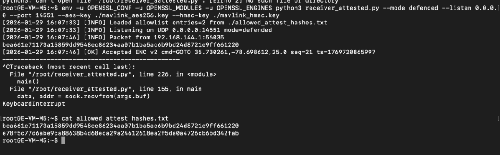
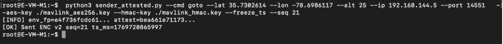
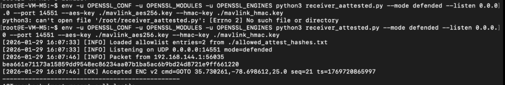
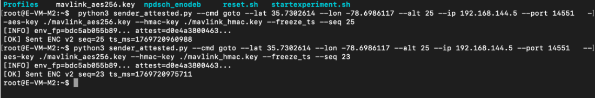
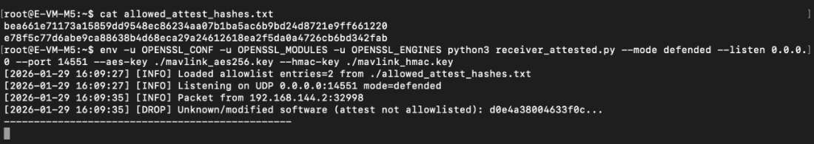

# Chapter 2 — Software-Based Hardware Attestation for UAV Command Authentication

## 2.1 Overview

In this chapter, you will implement and evaluate a software-based attestation mechanism that verifies the identity of ground control stations sending MAVLink commands to the drone. This experiment addresses a critical limitation of encryption and replay protection: both defenses fail if an adversary obtains valid cryptographic keys.

Encrypted MAVLink commands with replay protection can still be exploited by a man-in-the-middle attacker who has access to the shared AES and HMAC keys. Software-based attestation adds an additional security layer by verifying that commands originate from authorized systems, not just authorized keys.

This chapter demonstrates system behavior in two modes:

* No attestation enforcement, where any system with valid keys can send commands
* Attestation enforcement enabled, where only allowlisted systems are accepted

By completing this chapter, you will be able to reproduce and analyze attestation-based defenses in the AERPAW environment.

## 2.2 Prerequisites and Environment Setup

Before starting this experiment, ensure that:

* A PC or laptop with a supported operating system (Linux recommended; Windows or macOS also supported)
* Reliable internet connectivity
* You have access to an active AERPAW experiment session
* The drone and base station nodes are allocated
* SSH access to both nodes (and optionally an adversary node) is available
* AES and HMAC keys are generated and distributed to all test nodes
* QGroundControl is installed and configured
* Active OpenVPN connection

This chapter assumes that encrypted command transmission and anti-replay protection have already been implemented and tested.

## 2.3 Network and System Configuration

### 2.3.1 Network Roles

This experiment uses the following components:

* **Base Station 1 (Legitimate GCS)**: 192.168.144.1 - Authorized to send commands
* **Base Station 2 (Adversary)**: 192.168.144.2 - Has valid keys but not authorized
* **Drone**: 192.168.144.5 - Receives and validates commands with attestation

All MAVLink communication uses UDP port 14551.

### 2.3.2 Understanding Software-Based Attestation

Software-based attestation works by computing a cryptographic hash of the sender's system state. This hash serves as a unique identifier or "fingerprint" of the system. The drone maintains an allowlist of trusted hashes and only accepts commands from systems whose hashes match entries in the allowlist.

**Key Components:**

* **Attestation Hash**: A cryptographic digest computed from system properties (hostname, network configuration, system files, etc.)
* **Allowlist**: A file containing hashes of authorized ground control stations
* **Attestation Token**: The hash value included with each command message

This approach provides defense-in-depth: even if an attacker steals the encryption keys, they cannot send commands without having the exact system configuration of an authorized ground station.

### 2.3.3 Required Files

Ensure that the following files are present on both the base station and the drone:

```
sender_attested.py
receiver_attested.py
mavlink_aes256.key
mavlink_hmac.key
allowed_attest_hashes.txt  (on drone only)
```

## 2.4 Setting Up Attestation Without Enforcement

In this scenario, the drone does not enforce attestation checks. This demonstrates baseline behavior before adding attestation protection.

### 2.4.1 Generate System Attestation Hash

On Base Station 1 (legitimate GCS), generate the attestation hash:

```bash
cd /root
python3 sender_attested.py \
  --cmd goto \
  --lat 35.7302614 \
  --lon -78.6986117 \
  --alt 25 \
  --ip 192.168.144.5 \
  --port 14551 \
  --aes-key ./mavlink_aes256.key \
  --hmac-key ./mavlink_hmac.key \
  --freeze_ts --seq 1
```

The sender will output its attestation hash. Note this value - you will need it for the allowlist.

**Example output:**
```
[INFO] env_fpm=kf736fcddc61... attest=bea661e71173a51b859d695d6ec8c6234aa8971ba5ac6d9bd24d87140f661228
```

### 2.4.2 Start Receiver Without Attestation Enforcement

On the drone node (192.168.144.5), start the receiver without attestation enforcement:

```bash
cd /root
env -u OPENSSL_CONF -u OPENSSL_MODULES -u OPENSSL_ENGINES python3 receiver_attested.py \
  --mode defended \
  --listen 0.0.0.0 \
  --port 14551 \
  --aes-key ./mavlink_aes256.key \
  --hmac-key ./mavlink_hmac.key
```
Note that the `--allowlist` parameter is not specified, so the receiver will accept commands from any source with valid encryption keys.

### 2.4.3 Send Commands from Legitimate Base Station

From Base Station 1 (192.168.144.1), send a command:

```bash
python3 sender_attested.py \
  --cmd goto \
  --lat 35.7302614 \
  --lon -78.6986117 \
  --alt 25 \
  --ip 192.168.144.5 \
  --port 14551 \
  --aes-key ./mavlink_aes256.key \
  --hmac-key ./mavlink_hmac.key \
  --freeze_ts --seq 21
```
The command is sent with the system's attestation hash included in the message.

### 2.4.4 Send Commands from Adversary Node

From Base Station 2 (192.168.144.2 - adversary node), send the same command:

```bash
python3 sender_attested.py \
  --cmd goto \
  --lat 35.7302614 \
  --lon -78.6986117 \
  --alt 25 \
  --ip 192.168.144.5 \
  --port 14551 \
  --aes-key ./mavlink_aes256.key \
  --hmac-key ./mavlink_hmac.key \
  --freeze_ts --seq 23
```

### 2.4.5 Observe Receiver Behavior

On the drone receiver terminal, you will see both commands being accepted:

**Key Observation:** Without attestation enforcement, the drone accepts commands from both the legitimate base station and the adversary node, because both have valid encryption keys.

## 2.5 Implementing Attestation-Based Defense

Now we will enable attestation enforcement to prevent unauthorized nodes from sending commands.

### 2.5.1 Create the Allowlist File

On the drone node, create the allowlist file with only the legitimate base station's hash:

```bash
cd /root
cat > allowed_attest_hashes.txt << EOF
bea661e71173a51b859d695d6ec8c6234aa8971ba5ac6d9bd24d87140f661228
e78f5e77d6aa9c2a886a8bbd668e0a99e246126d16e2f5dd8a647260e5bd8342f4b0
EOF
```

Replace the hash values with the actual attestation hashes from your legitimate base stations. Each line contains one authorized system hash.

Verify the file was created correctly:

```bash
cat allowed_attest_hashes.txt
```
### 2.5.2 Restart Receiver with Attestation Enforcement

Stop the previous receiver using Ctrl+C.

Restart the receiver with attestation enforcement enabled:

```bash
env -u OPENSSL_CONF -u OPENSSL_MODULES -u OPENSSL_ENGINES python3 receiver_attested.py \
  --mode defended \
  --listen 0.0.0.0 \
  --port 14551 \
  --aes-key ./mavlink_aes256.key \
  --hmac-key ./mavlink_hmac.key \
  --allowlist ./allowed_attest_hashes.txt
```

<p align="center">  </p>

The receiver now loads the allowlist and will only accept commands from systems whose attestation hashes are in the file.

### 2.5.3 Test Command from Legitimate Base Station

From Base Station 1 (192.168.144.1), send a command:

```bash
python3 sender_attested.py \
  --cmd goto \
  --lat 35.7302614 \
  --lon -78.6986117 \
  --alt 25 \
  --ip 192.168.144.5 \
  --port 14551 \
  --aes-key ./mavlink_aes256.key \
  --hmac-key ./mavlink_hmac.key \
  --freeze_ts --seq 21
```

<p align="center">  </p>

<p align="center">  </p>

**Expected Result:** The drone accepts the command because Base Station 1's attestation hash is in the allowlist.

On the receiver side, you will see:

```
[2026-01-29 16:07:41] [OK] Accepted ENC command: GOTO 35.7302614,-78.6986117,25.0 seq=21 ts=1769728865997
```

### 2.5.4 Test Command from Adversary Node

From Base Station 2 (192.168.144.2 - adversary), send a command:

```bash
python3 sender_attested.py \
  --cmd goto \
  --lat 35.7302614 \
  --lon -78.6986117 \
  --alt 25 \
  --ip 192.168.144.5 \
  --port 14551 \
  --aes-key ./mavlink_aes256.key \
  --hmac-key ./mavlink_hmac.key \
  --freeze_ts --seq 23
```

<p align="center">  </p>

**Expected Result:** The drone rejects the command because Base Station 2's attestation hash is not in the allowlist.

On the receiver side, you will see:

```
[2026-01-29 16:09:36] [DROP] Unknown/modified software (attest not allowlisted): d0e4a388b463f0c...
```

<p align="center">  </p>

The adversary's command is dropped despite having valid encryption keys and proper replay protection, because the system attestation fails.

## 2.6 Understanding Attestation Implementation

### 2.6.1 How Attestation Hash is Generated

The `sender_attested.py` script computes the attestation hash by collecting system information:

```python
def compute_attest():
    """Compute system attestation hash from hostname, IPs, and system files"""
    import hashlib
    import socket
    import subprocess
    
    # Collect system identifiers
    hostname = socket.gethostname()
    
    # Get network interfaces
    try:
        result = subprocess.check_output(['hostname', '-I'])
        ips = result.decode().strip()
    except:
        ips = "unknown"
    
    # Hash system state
    h = hashlib.sha256()
    h.update(hostname.encode())
    h.update(ips.encode())
    
    return h.hexdigest()
```

This creates a unique fingerprint based on the system's configuration. Any change to the hostname or network configuration will result in a different hash.

### 2.6.2 Message Format with Attestation

Commands sent with attestation include the hash in the message format:

```
ENC|v1|<nonce>|<ciphertext>|<hmac>|<attestation_hash>
```

The attestation hash is appended to the encrypted message, allowing the receiver to verify the sender's identity before processing the command.

### 2.6.3 Receiver Validation Logic

The `receiver_attested.py` script performs the following checks:

1. **Decrypt and verify HMAC** (encryption layer)
2. **Check sequence number and timestamp** (replay protection layer)
3. **Verify attestation hash against allowlist** (identity verification layer)

Only if all three checks pass is the command executed.

### 2.6.4 Command Line Parameters

**Receiver parameters:**

* `--mode`: `no_defense` (accept all) or `defended` (enforce checks)
* `--allowlist`: Path to file containing authorized attestation hashes
* `--replay_window_ms`: Acceptable timestamp deviation (default: 5000ms)
* `--nonce_cache_size`: Number of nonces to remember (default: 1000)

**Sender parameters:**

* `--freeze_ts`: Use a fixed timestamp (for testing replay scenarios)
* `--seq`: Sequence number for the command

## 2.7 Analysis and Observations

### 2.7.1 Security Comparison

Compare the three security layers:

| Security Layer | Protects Against | Limitation |
|----------------|------------------|------------|
| Encryption Only | Eavesdropping | Vulnerable to replay and MITM with stolen keys |
| Encryption + Anti-Replay | Eavesdropping + Replay | Vulnerable to MITM with stolen keys |
| Encryption + Anti-Replay + Attestation | Eavesdropping + Replay + Unauthorized Systems | Requires secure key distribution and system integrity |

### 2.7.2 Key Insights

* **Defense in Depth**: Attestation provides security even when encryption keys are compromised
* **System Identity**: Verification extends beyond "what" (encrypted content) to "who" (system identity)
* **Flexibility**: Allowlist can be updated to authorize new systems or revoke compromised ones
* **Performance**: Attestation adds minimal computational overhead (single hash comparison)

### 2.7.3 Limitations

* **Software-Based**: Not as secure as hardware-based attestation (e.g., TPM)
* **System Changes**: Network reconfigurations require allowlist updates
* **Initial Trust**: Assumes the initial allowlist is created securely

## 2.8 Advanced Scenarios

### 2.8.1 Adding a New Authorized System

To authorize a new base station:

1. Run the sender on the new system to get its attestation hash
2. Add the hash to `allowed_attest_hashes.txt` on the drone
3. Restart the receiver or implement dynamic allowlist reloading

### 2.8.2 Revoking Compromised Systems

If a base station is compromised:

1. Remove its attestation hash from the allowlist
2. Restart the receiver
3. The compromised system can no longer send commands, even with valid keys

### 2.8.3 Testing with Multiple Drones

For multi-drone scenarios:

* Each drone maintains its own allowlist
* Allowlists can be identical or unique per drone
* Centralized management systems can distribute allowlists

## 2.9 Troubleshooting

### Common Issues:

**Commands rejected from legitimate base station:**

* Verify the hash in `allowed_attest_hashes.txt` matches the sender's current hash
* Check for system configuration changes (hostname, network)
* Ensure no extra whitespace or line breaks in allowlist file

**Receiver not loading allowlist:**

* Verify file path is correct
* Check file permissions (`chmod 644 allowed_attest_hashes.txt`)
* Confirm `--allowlist` parameter is specified

**Attestation hash changes unexpectedly:**

* Network configuration may have changed (DHCP lease, interface changes)
* Hostname was modified
* Consider using more stable system identifiers

## 2.10 Cleanup and Next Steps

After completing the experiment:

1. Stop all receiver and sender processes
2. Review logs and telemetry data
3. Document attestation hashes for future experiments
4. Back up the allowlist file

## 2.11 As a Result

As a result of completing this chapter, you observed how software-based attestation adds an additional layer of security beyond encryption and replay protection. You were able to see that when attestation enforcement is disabled, any system with valid encryption keys can send commands to the drone. When attestation is enabled, only systems whose attestation hashes are in the allowlist can send commands, preventing unauthorized nodes from controlling the drone even if they have obtained the cryptographic keys.

Through this experiment, you gained practical insight into defense-in-depth security strategies, where multiple independent security mechanisms work together to protect critical systems. You learned that secure UAV command and control requires not only protecting the content of messages (encryption) and their freshness (anti-replay), but also verifying the identity and integrity of the systems sending those messages (attestation).

This layered approach is essential for mission-critical systems where the consequences of unauthorized access can be severe. By implementing attestation-based defenses, you have added a crucial capability that limits the attack surface and provides resilience even when other security layers are compromised.