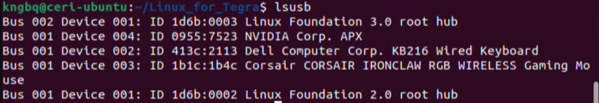
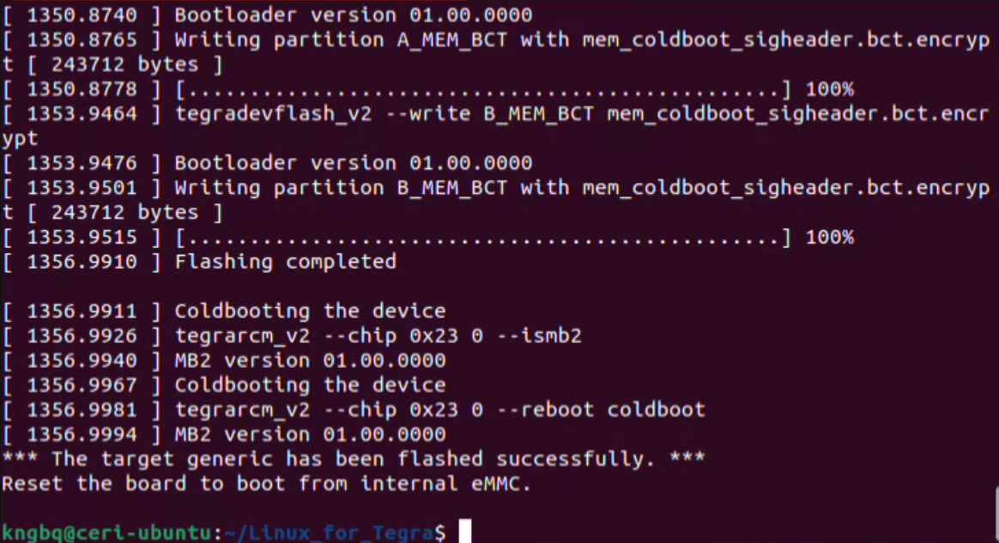

# Chapter 3: Physical Setup and Flashing Process

## 1. Put Jetson Into Force Recovery Mode

1. Power off the Jetson
2. Enter **Force Recovery Mode** (board-specific button/jumper sequence)
3. Connect the Jetson to the host system using a USB cable capable of recovery mode (USB-A to USB-C is recommended, especially when using virtual machines).

Verify on host:
```bash
lsusb
```
or
```bash
lsusb | grep NVIDIA
```
or
```bash
lsusb | grep -i nvidia || true
```

You should see an NVIDIA device in recovery mode.

Example: **0955:7xxx NVIDIA Corp. APX**

**If you don't, flashing will not work (USB passthrough/filter needs fixing).**



---
## 2. Run Flash Command

Once the Jetson Orin Nano is confirmed to be in recovery mode and detected by the host, navigate to the BSP directory and initiate flashing.

This flash is performed on an unfused board and is intended to validate OP-TEE and fTPM functionality before any fuse-burning steps.
```bash
cd ~/Linux_for_Tegra

sudo ./flash.sh jetson-orin-nano-devkit mmcblk0p1

```

Once the Flashing process ends successfully, you will recieve this message:
```bash
*** The target generic has been flashed successfully. ***
Reset the board to boot from internal eMMC.
```


