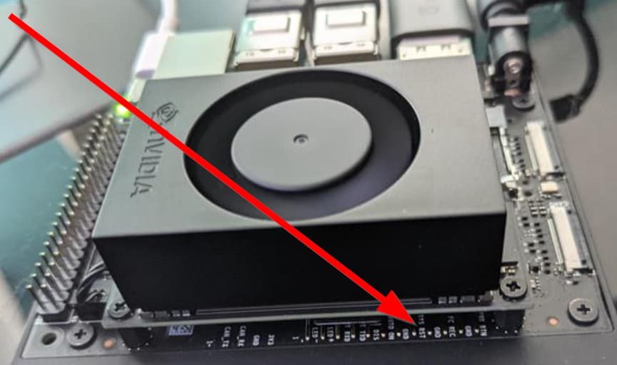
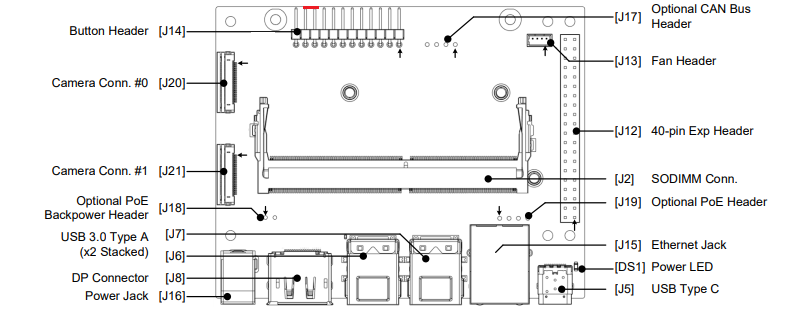

# Chapter 3: Physical Setup and Flashing Process

## 1. Put Jetson Into Force Recovery Mode

Main Steps to Enter Force Recovery Mode:
1. Power Off: Ensure the Jetson Orin Nano is completely disconnected from power.
2. Bridge Pins: Locate the J14 header (button header) on the carrier board. Place a 2.54mm jumper cap across pin 9 (FC_REC) and pin 10 (GND).



<p align="center">Jetson Orin Nano Carrier Board Placement - Top View (Red Line indicated PINS 9 and 10)</p>

3. Connect Power: Connect the power supply to the developer kit.
4. Verify: Connect the USB-C port that is capable of data transfer to your Linux host PC (USB-A to USB-C is recommended, especially when using virtual machines). Run `lsusb` and look for `0955:7xxx NVidia Corp` to confirm it is in recovery mode.
5. Remove Jumper: Once confirmed, you can remove the jumper. 


Verify on host:
```bash
lsusb
```
or
```bash
lsusb | grep NVIDIA
```
or
```bash
lsusb | grep -i nvidia || true
```

You should see an NVIDIA device in recovery mode.

Example: **0955:7523 NVIDIA Corp. APX**

**If you don't, flashing will not work (USB passthrough/filter needs fixing).**


## 2. Run Flash Command

Once the Jetson Orin Nano is confirmed to be in recovery mode and detected by the host, navigate to the BSP directory and initiate flashing.

This flash is performed on an unfused board and is intended to validate OP-TEE and fTPM functionality before any fuse-burning steps.
```bash
cd ~/Linux_for_Tegra

sudo ./flash.sh jetson-orin-nano-devkit mmcblk0p1
```

Once the Flashing process ends successfully, you will recieve this message:
```bash
*** The target generic has been flashed successfully. ***
Reset the board to boot from internal eMMC.
```


