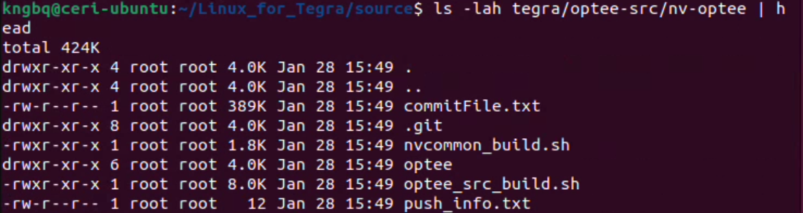
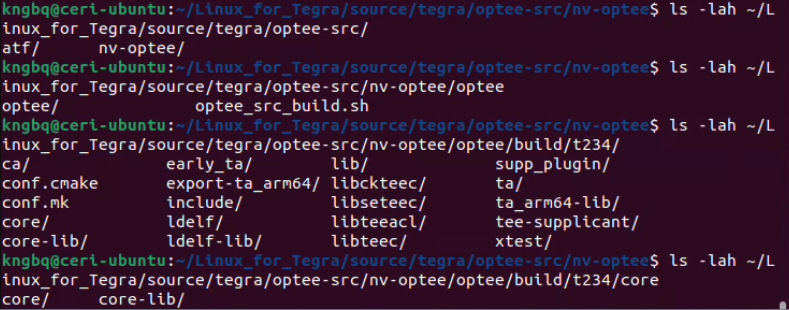
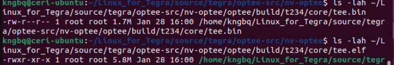
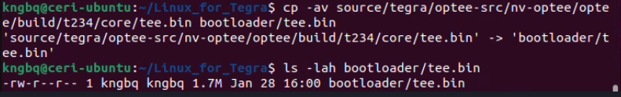
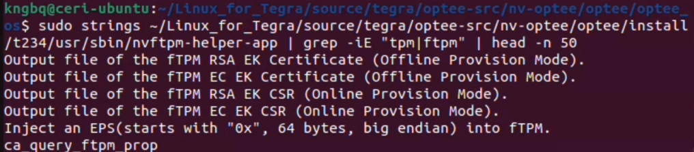
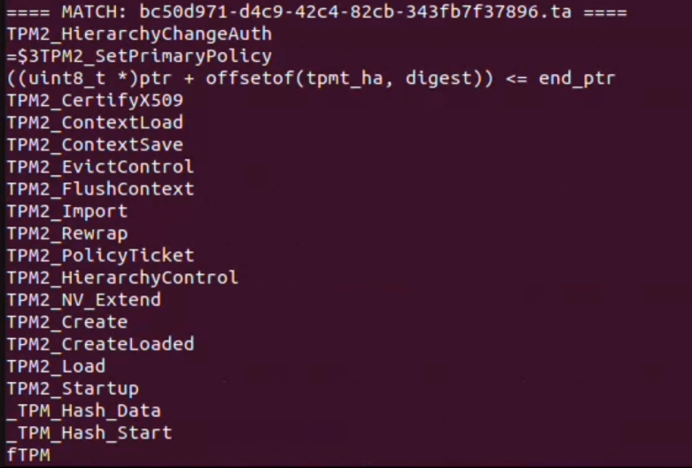
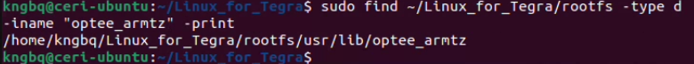
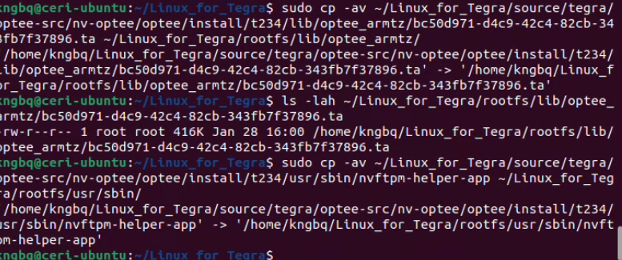

# Secure Boot & Signed OS Guide — Jetson Orin Nano (Jetson Linux r36.4.3)

> **Goal:** Configure a Jetson Orin Nano to boot only cryptographically signed and verified firmware and software, using NVIDIA Secure Boot (PKC, optional SBK), with OP-TEE enabled and optional UEFI Secure Boot support.

---

# High‑Level Secure Boot Flow
This guide is divided into two major phases.
Section A focuses on preparing software artifacts on the host system, including OP-TEE and fTPM integration.
Section B covers physical setup and flashing the device in recovery mode.

**A. Software Setup**

1. OS Update and Package Installation

2. Download Jetson Linux r36.4.3 (BSP + RootFS)

3. Extract BSP and Populate RootFS

4. Sync Sources to Receive Proper OPTEE-Build Files

5. Build OP-TEE with fTPM enabled

6. Copy the built OP-TEE core (tee.bin) into the BSP Bootloader folder

7. fTPM Check

8. Copy the second part of the built OP-TEE core (tee.elf) into the BSP Bootloader folder

9. Find the TrustZone Application (TA)

10. Copy the TrustZone Application (TA) and Helper App to Optee_armtz

**B. Physical Setup and Booting Process**

1. Put Jetson Into Force Recovery Mode

2. Run Flash Command

---

# Host Requirements

- Ubuntu 22.04 (native host **strongly recommended**)
- USB‑C cable capable of recovery mode
- NVIDIA Developer account (for downloads)

> VirtualBox setups can work, but USB passthrough instability is common. This is especially risky during flashing and should never be used when burning fuses unless you fully understand the failure modes

---
# Software Setup

## A-1. OS Update and Package Installation

Update the host operating system and install all required build, flashing, and cross-compilation dependencies before continuing.

```bash
sudo apt update
sudo apt install -y \
  build-essential \
  git \
  wget \
  curl \
  python3 \
  python3-pip \
  libssl-dev \
  libncurses5-dev \
  bison \
  flex \
  libelf-dev \
  bc \
  cpio \
  rsync \
  device-tree-compiler \
  u-boot-tools \
  lz4 \
  zstd \
  usbutils \ 
  gcc-aarch64-linux-gnu \
  g++-aarch64-linux-gnu \
  pkg-config
```
```bash
sudo apt-get install qemu-user-tools
```
```bash
sudo apt-get install libxml2-utils
```
---

## A-2. Download Jetson Linux r36.4.3 (BSP + RootFS)

Run the following from your Linux host:

```bash
# Jetson Linux BSP (driver package + flashing tools)
wget https://developer.nvidia.com/downloads/embedded/l4t/r36_release_v4.3/release/Jetson_Linux_r36.4.3_aarch64.tbz2

# Sample Ubuntu root filesystem
wget https://developer.nvidia.com/downloads/embedded/l4t/r36_release_v4.3/release/Tegra_Linux_Sample-Root-Filesystem_r36.4.3_aarch64.tbz2
```

> You must be logged into your NVIDIA Developer account and have accepted the Jetson Linux license agreement, otherwise these downloads will fail or redirect to an authentication page.

---

## A-3. Extract BSP and Populate RootFS

```bash
tar xf Jetson_Linux_r36.4.3_aarch64.tbz2
cd Linux_for_Tegra

sudo tar xpf ../Tegra_Linux_Sample-Root-Filesystem_r36.4.3_aarch64.tbz2 -C rootfs
sudo ./apply_binaries.sh
```

At this stage, the Jetson Linux BSP and Ubuntu root filesystem are fully assembled and ready for source synchronization and OP-TEE integration.

---

## A-4. Sync Sources to Receive Proper OPTEE-Build Files

Navigate to the source directory and run source_sync.sh to retrieve NVIDIA-matched kernel, OP-TEE, and platform sources for Jetson Linux r36.4.x.

```bash
cd ~/nvidia/Linux_for_Tegra/source
sudo ./source_sync.sh
```

When prompted for a tag, you must enter **jetson_36.4**.
This ensures the OP-TEE and kernel sources match the Jetson Linux r36.4.3 (or r36.4.x) BSP. Using a different tag may result in build or runtime failures.

Example Prompt:
```bash
vboxuser@nvFlasher2:~/nvidia/Linux_for_Tegra/source$ sudo ./source_sync.sh
Downloading default kernel/kernel-jammy-src source...
Cloning into '/home/vboxuser/nvidia/Linux_for_Tegra/source/kernel/kernel-jammy-src'...
remote: Enumerating objects: 8617907, done.
remote: Counting objects: 100% (8617907/8617907), done.
remote: Compressing objects: 100% (1256155/1256155), done.
Receiving objects: 100% (8617907/8617907), 1.88 GiB | 31.61 MiB/s, done.
remote: Total 8617907 (delta 7322146), reused 8605619 (delta 7309884), pack-reused 0 (from 0)
Resolving deltas: 100% (7322146/7322146), done.
Checking objects: 100% (33554432/33554432), done.
The default kernel/kernel-jammy-src source is downloaded in: /home/vboxuser/nvidia/Linux_for_Tegra/source/kernel/kernel-jammy-src
Please enter a tag to sync /home/vboxuser/nvidia/Linux_for_Tegra/source/kernel/kernel-jammy-src source to
(enter nothing to skip): jetson_36.4
Syncing up with tag jetson_36.4...
```
After sync, confirm OP-TEE shows up:

```bash
# Check parent folder
ls -lah tegra/optee-src
# Check for files
ls -lah tegra/optee-src/nv-optee | head
# Check for any files in the sub folders with anything optee related
find . -maxdepth 4 -iname "*optee*" | head -n 50
```
Example Output:


---

## A-5. Build OP-TEE with fTPM enabled 
In the NVIDIA OP-TEE source tree synced via source_sync.sh, the correct build driver is optee_src_build.sh. This script is required for building OP-TEE with NVIDIA-specific integrations.

First, make sure the paths are exported into the userspace:

```bash
cd ~/Linux_for_Tegra/source/tegra/optee-src/nv-optee

# Toolchain env (NVIDIA script expects these)
export CROSS_COMPILE_AARCH64_PATH=/usr
export CROSS_COMPILE_AARCH64=/usr/bin/aarch64-linux-gnu-
export PKG_CONFIG=/usr/bin/pkg-config

# STMM binary used by OP-TEE build (you should already have it in your BSP)
export UEFI_STMM_PATH=~/Linux_for_Tegra/bootloader/standalonemm_optee_t234.bin
```
Now run the OP-TEE build. 

> The -t flag enables NVIDIA’s firmware TPM (fTPM) support within OP-TEE for T234-based platforms. This flag is required to expose TPM 2.0 functionality through OP-TEE at runtime.

For The Jetson Nano Orin, the tag will be **(t234)**.

```bash
cd ~/Linux_for_Tegra/source/tegra/optee-src/nv-optee
# Build OP-TEE + fTPM
sudo -E ./optee_src_build.sh -p t234 -t
```

To confirm that the Optee source was built properly, run these ls commands to confirm the Optee files exist:

```bash
# Check for /optee-src
ls -lah ~/Linux_for_Tegra/source/tegra/optee-src/
# Check for /optee
ls -lah ~/Linux_for_Tegra/source/tegra/optee-src/nv-optee/optee
# Check for /t234
ls -lah ~/Linux_for_Tegra/source/tegra/optee-src/nv-optee/optee/build/t234/
# Check for /core
ls -lah ~/Linux_for_Tegra/source/tegra/optee-src/nv-optee/optee/build/t234/core
# Check for tee.bin
ls -lah ~/Linux_for_Tegra/source/tegra/optee-src/nv-optee/optee/build/t234/core/tee.bin
# Check for tee.elf
ls -lah ~/Linux_for_Tegra/source/tegra/optee-src/nv-optee/optee/build/t234/core/tee.elf
```


---

## A-6. Copy the built OP-TEE core (tee.bin) into the BSP Bootloader folder

After the OP-TEE build completes successfully and the output files are verified, copy the newly built tee.bin into the BSP bootloader directory so it is included during flashing.
```bash
cd ~/nvidia/Linux_for_Tegra

# (optional) backup existing tee.bin if present
cp -av bootloader/tee.bin bootloader/tee.bin.bak 2>/dev/null || true

# copy newly built tee.bin into bootloader/
cp -av source/tegra/optee-src/nv-optee/optee/build/t234/core/tee.bin bootloader/tee.bin

# verify
ls -lah bootloader/tee.bin
```


---

## A-7. fTPM System and File Check

This step verifies that fTPM support was correctly enabled during the OP-TEE build and that the expected configuration and artifacts were generated.

Run this grep command:

```bash
sudo grep -RIn "CFG_FTPM\|ftpm\|tpm" \
  ~/nvidia/Linux_for_Tegra/source/tegra/optee-src/nv-optee/optee/build/t234/conf.mk \
  ~/nvidia/Linux_for_Tegra/source/tegra/optee-src/nv-optee/optee/optee_os/mk/config.mk \
  2>/dev/null | head -n 120
```
And check if an fTPM TA shows up in install output:

```bash
find ~/Linux_for_Tegra/source/tegra/optee-src/nv-optee/optee/install/t234 \
-type f \( -iname "*tpm*" -o -iname "*ftpm*" -o -iname " *. ta" \) | head -n 50
```
See if any tpm or ftpm related files are displayed after this command is used. 

---
## A-8. Copy the second part of the built OP-TEE core (tee.elf) into the BSP Bootloader folder

Confirm that the tee.elf and tee.bin exist:
```bash
ls -lah ~/Linux_for_Tegra/source/tegra/optee-src/nv-optee/optee/build/t234/core/tee.bin

ls -lah ~/Linux_for_Tegra/source/tegra/optee-src/nv-optee/optee/build/t234/core/tee.elf
```

Copy the `tee.elf` file into the BSP `bootloader` directory. This ELF image is required by the boot chain for OP-TEE initialization and debugging support.

```bash
cp -av ~/Linux_for_Tegra/source/tegra/optee-src/nv-optee/optee/build/t234/core/tee.elf bootloader/tee.elf
```

---
## A-9. Find the TrustZone Application (TA) 

Confirm that the fTPM TrustZone Application (TA) and supporting binaries were generated as part of the OP-TEE build and install process.

Run the strings and grep command to confirm the Output files of the fTMP.

```bash
strings ~/nvidia/Linux_for_Tegra/source/tegra/optee-src/nv-optee/optee/install/t234/usr/sbin/nvftpm-helper-app | \
  grep -iE "tpm|ftpm" | head -n 50
```
Example Output:


Run this grep as well to further confirm the fTPM files exist:

```bash
grep -RIn "ftpm\|tpm" \
  ~/nvidia/Linux_for_Tegra/source/tegra/optee-src/nv-optee/optee/optee_os 2>/dev/null | head -n 120
```
An output should return with various file names related to TPM and fTPM.

Run the following script to identify the fTPM TrustZone Application (TA) by scanning for TPM-related symbols inside installed TA binaries.

```bash
for f in ~/nvidia/Linux_for_Tegra/source/tegra/optee-src/nv-optee/optee/install/t234/lib/optee_armtz/*.ta; do
  if strings "$f" 2>/dev/null | grep -qiE 'ftpm|tpm2|tpm'; then
    echo "==== MATCH: $(basename "$f") ===="
    strings "$f" | grep -iE 'ftpm|tpm2|tpm' | head -n 40
    echo
  fi
done
```

Example Output:


Example Output:
**MATCH: bc50d971-d4c9-42c4-82cb-343fb7f37896.ta**

Confirm the Trust Application Files exist in `/optee_armtz`.
```bash
ls -lah ~/nvidia/Linux_for_Tegra/source/tegra/optee-src/nv-optee/optee/install/t234/lib/optee_armtz/*.ta | sort -k5 -h | tail -n 30
```
or, use the file name to find if that file exists in the folder.
```bash
ls -lah ~/nvidia/Linux_for_Tegra/source/tegra/optee-src/nv-optee/optee/install/t234/lib/optee_armtz/bc50d971-d4c9-42c4-82cb-343fb7f37896.ta
```

```bash
sudo find ~/nvidia/Linux_for_Tegra/rootfs -type d -iname "optee_armtz" -print
```


---

## A-10. Copy the TrustZone Application (TA) and Helper App to Optee_armtz

Copy the fTPM TrustZone Application (TA) into the target root filesystem so it will be available to OP-TEE at runtime.

```bash
sudo cp -av ~/Linux_for_Tegra/source/tegra/optee-src/nv-optee/optee/install/t234/lib/optee_armtz/bc50d971-d4c9-42c4-82cb-343fb7f37896.ta ~/Linux_for_Tegra/rootfs/lib/optee_armtz/
```

Verify:

```bash
ls -lah ~/Linux_for_Tegra/rootfs/lib/optee_armtz/bc50d971-d4c9-42c4-82cb-343fb7f37896.ta
```

Copy the nvftpm-helper-app into the target root filesystem. This userspace helper is required to interface with the fTPM service once the system boots.

```bash
sudo cp -av ~/Linux_for_Tegra/source/tegra/optee-src/nv-optee/optee/install/t234/usr/sbin/nvftpm-helper-app ~/Linux_for_Tegra/rootfs/usr/sbin/
```


---

# B. Physical Setup and Flashing Process

## B-1. Put Jetson Into Force Recovery Mode

1. Power off the Jetson
2. Enter **Force Recovery Mode** (board‑specific button/jumper sequence)
3. Connect the Jetson to the host system using a USB cable capable of recovery mode (USB-A to USB-C is recommended, especially when using virtual machines).

Verify on host:

```bash
lsusb | grep NVIDIA
```
or
```bash
lsusb | grep -i nvidia || true
```

You should see an NVIDIA device in recovery mode. 

Example: **0955:7xxx NVIDIA Corp. APX**

**If you don’t, flashing will not work (USB passthrough/filter needs fixing).**


---
## B-2. Run Flash Command

Once the Jetson Orin Nano is confirmed to be in recovery mode and detected by the host, navigate to the BSP directory and initiate flashing.

This flash is performed on an unfused board and is intended to validate OP-TEE and fTPM functionality before any fuse-burning steps.
```bash
cd ~/Linux_for_Tegra

sudo ./flash.sh jetson-orin-nano-devkit mmcblk0p1

```

Once the Flashing process ends successfully, you will recieve this message:
```bash
*** The target generic has been flashed successfully. ***
Reset the board to boot from internal eMMC.
```


---

## Common Failure Points

- Burning fuses before validating signed flashing
- Losing PKC/SBK key material
- USB instability during fuse burn
- Mixing Jetson Linux versions (r36 vs r38 docs)

---

## Outcome

After successfully completing this guide and validating the flashed system, the Jetson Orin Nano will:
- Boot only cryptographically signed firmware
- Reject unsigned bootloaders and kernels
- Enforce hardware root‑of‑trust from BootROM upward

---

**End of guide**

