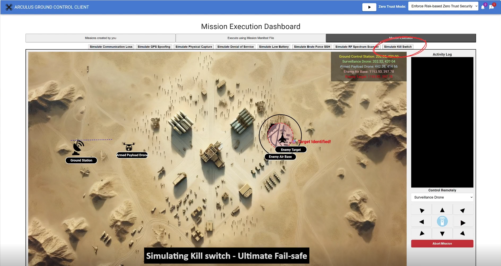
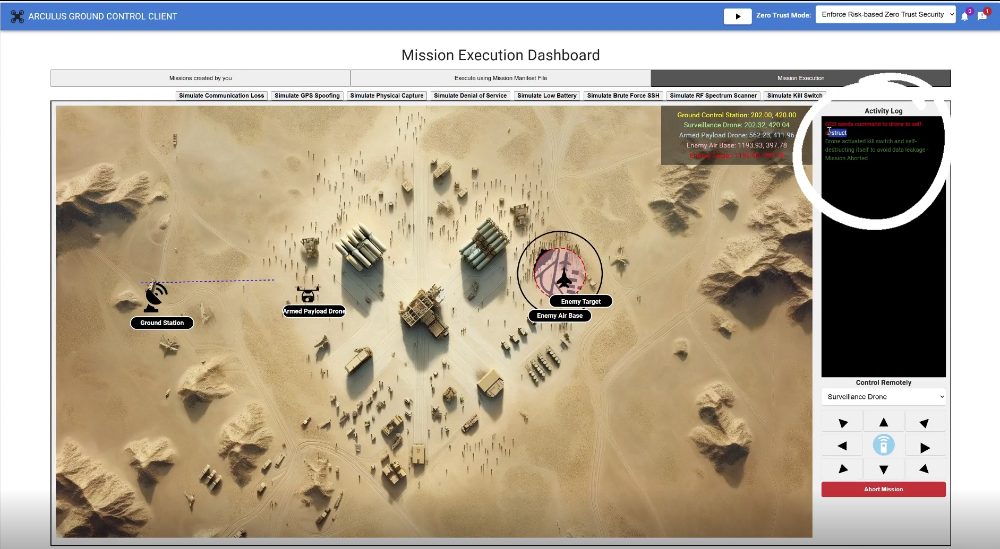
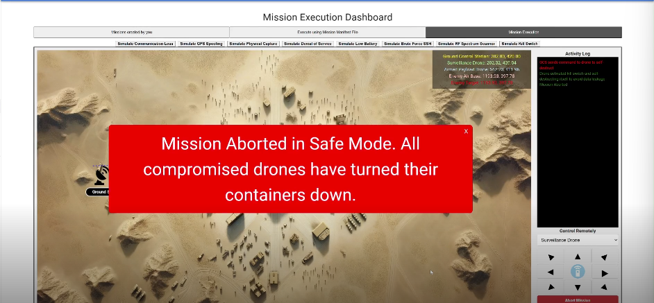

# Chapter 2 Mission Execution: Kill Switch Scenarios

## 2.1 Overview

In this chapter, you will execute missions that demonstrate both manual and autonomous kill switch activation. You will observe how the system transitions from active execution to safe termination under different operational conditions. The objective of this chapter is to understand how kill switch mechanisms preserve system security and mission integrity when continued execution is no longer safe.

## 2.2 Launching the Mission

Navigate to the Mission Execution Dashboard and start the mission associated with the kill switch scenario. Once execution begins, observe the mission entering an active runtime state with drones deployed as expected.

Monitor the mission map and activity log to confirm normal execution before any kill switch conditions are introduced.

## 2.3 Operator-Initiated Kill Switch Activation

### 2.3.1 While active communication with the GCS is available, manually trigger the kill switch using the Kill Switch control in the Mission Execution Dashboard.

 

### 2.3.2 Once activated, observe the immediate termination of mission execution. The system begins controlled shutdown procedures, including stopping drone movement and securing mission data.

* Review the activity log to confirm that the kill switch was triggered by operator action and that safe termination procedures were enforced.

 

## 2.4 Autonomous Kill Switch Activation

### 2.4.1 In this scenario, allow the mission to continue until communication with the GCS is lost and cannot be re-established.

* When the system determines that mission integrity is at risk, the kill switch is activated autonomously without operator intervention. This represents a fail-safe response to potential physical capture or adversarial control.

* Observe the mission map and activity log as the system initiates safe shutdown and data protection mechanisms.

## 2.5 Monitoring Safe Termination Behavior

During both manual and autonomous kill switch activation, observe the system behavior carefully.

**Pay attention to:**

* Drone shutdown or immobilization

* Termination of on-board processes

* Log entries indicating secure termination

These behaviors confirm that the kill switch has successfully enforced mission safety.

## 2.6 Mission Termination Confirmation

* Once kill switch procedures are completed, the Mission Execution Dashboard displays a termination message indicating that the mission has ended in safe mode.

 

* Verify that mission status reflects termination due to kill switch enforcement.

## 2.7 As a Result

As a result of completing this module, you observed how the kill switch functions as the ultimate fail-safe during mission execution. You saw how the system enforces controlled shutdown through both operator-initiated and autonomous activation, ensuring data protection and preventing mission compromise. This module highlights the critical role of kill switch mechanisms in securing mission-oriented systems operating in adversarial environments.
