# Chapter 2 - Planning and Execution of Drone Missions on the Arculus Testbed

## 2.1 Overview

In this chapter, you will walk through the full lifecycle of planning and executing a drone mission using the Arculus Ground Control Portal. Building on the work completed in earlier chapters—where you enrolled devices into the cluster and configured their trusted roles—you will now use these drones to create an operational mission from start to finish.

The Mission Planning Dashboard allows you to define every aspect of a mission: which drones will be involved, the mission context and criticality, who can supervise or view the mission, and the logistical parameters required for safe execution. You will also interact with Arculus’ map interface to select a destination point, a mandatory step for mission creation. Arculus automatically validates each drone’s assigned capabilities and prevents missions from being created when required privileges are missing—an important enforcement of Zero-Trust principles.

Once a mission is successfully created, you will generate and examine an encrypted mission manifest (.mconf) file. Arculus signs and protects these manifests to prevent tampering; any unauthorized modification results in validation failure, denying execution. You will then upload the manifest or execute directly from the portal to launch the live mission.

During execution, you will observe how Arculus dynamically creates and removes network policies in real time using Task-Based Access Control (TBAC). These temporary policies allow drones to communicate only when required for mission tasks, reinforcing least-privilege operation. The Mission Execution Dashboard provides live telemetry, drone positions, event logs, and a control panel for simulating DDIL scenarios such as GPS spoofing, communication loss, jamming, battery drain, and other adversarial conditions.

By the end of this chapter, you will have completed a full mission run—from planning and validation to execution and adversarial testing—gaining insight into how Arculus secures autonomous operations under a Zero-Trust model.

## 2.2 Set-Up

* The Mission Planning Dashboard allows for configuring drone missions by specifying which devices to use, what the context (criticality) of the mission is, who the supervisors and viewers of the mission are, and logistics information. Configure these options to tune the criticality of the mission dictating the zero trust levels. The device fields are automatically populated based on the availability of the suitable types of devices.

 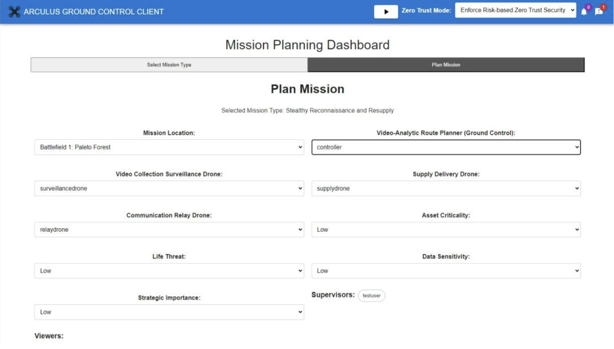

* The page also provides maps of locations to choose from. On these maps, users can pick a destination point for the delivery of supplies (here, the case of Stealthy Reconnaissance and Resupply mission). Try creating the mission without pointing a destination on the map, and the mission creation will not go ahead asking the user to place a destination on the map.

 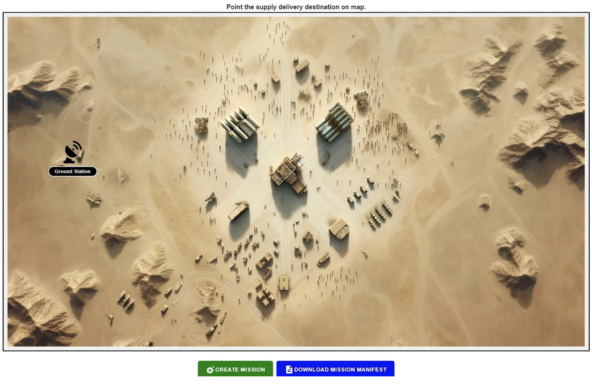

 

* Click anywhere on the map to set the supply destination to that location.

 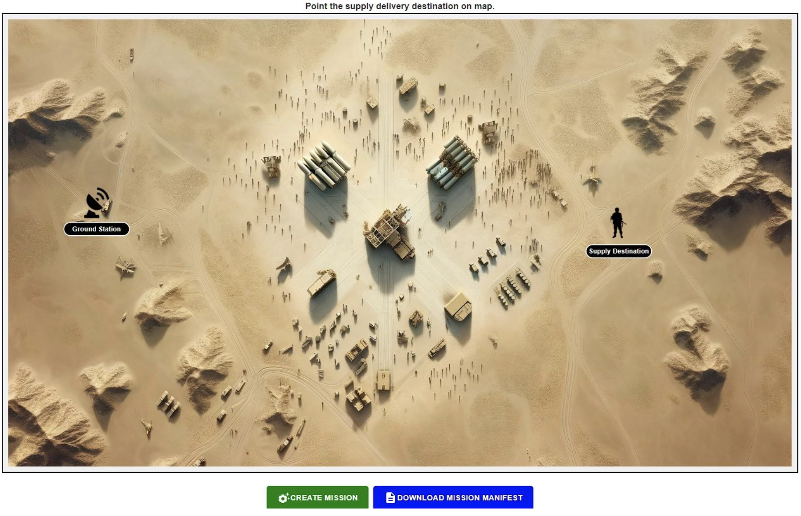

* Try updating the capabilities and remove one of the privileges specified in the device configuration step. The mission creation won’t go ahead because, inability of any of the devices to perform their respective functions will cause the mission to fail for sure. This validation mechanism is a proactive approach to missions whose failure cannot be afforded.

 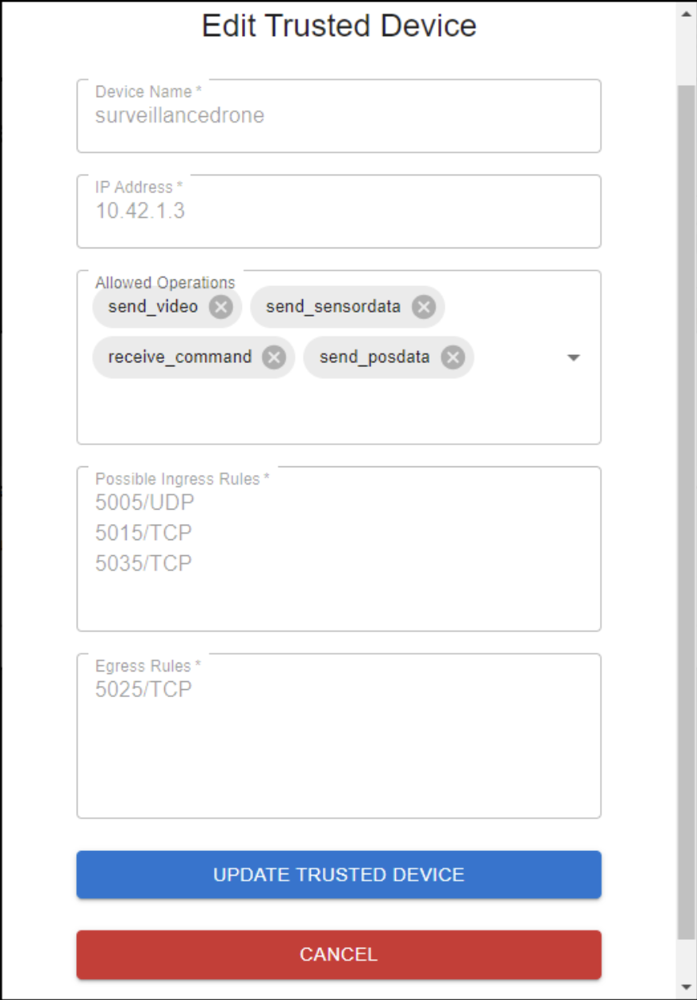

 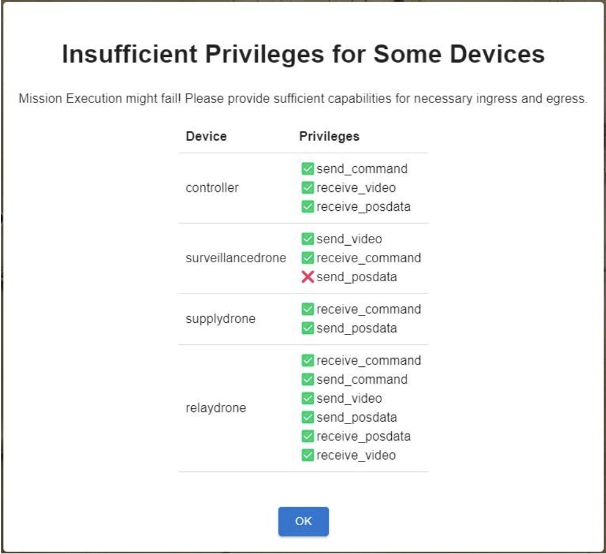

* Besides normal creation of missions, the “Download Mission Manifest” button allows users to download a repeatable manifest of their mission. This prevents multiple reconfigurations of a mission. The files are encrypted and downloaded with a .mconf extension.

 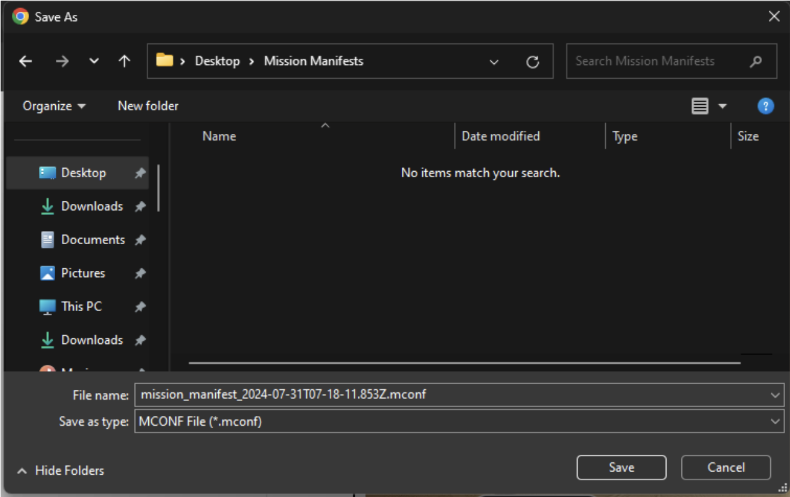

* From the screenshot below, the manifest files are encrypted and hence, modifications to these files by external actors invalidates the files, leaving no space for deliberate mission adulteration. The next screenshot shows how the Arculus application fetches the mission information from the .mconf file on executing with manifest.

 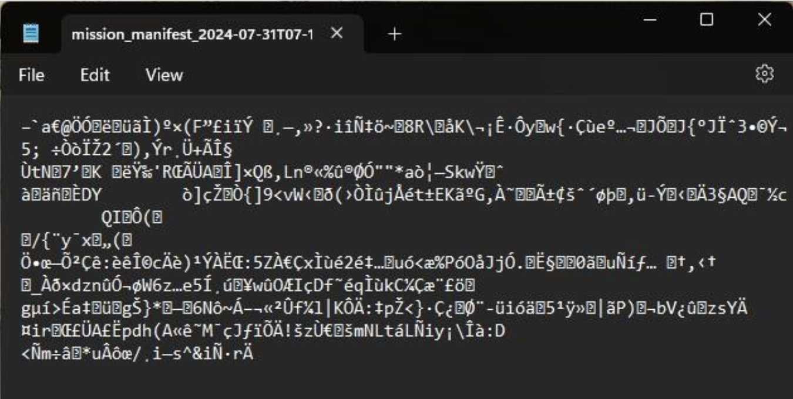

 

* However, try adding your own text to the manifest file and try to poison it as shown below. The application throws an error message identifying the manifest file to be bad.

 

 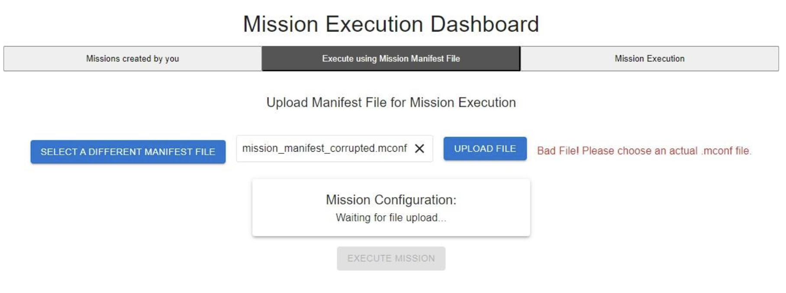

## 2.3 Manage Policies

* Before trying to execute a mission, click the “Manage Policies” tab that takes you to the Network Policy Management Dashboard. It can be seen as in the below screenshot, that there are no active network policies and all traffic is denied by default.

 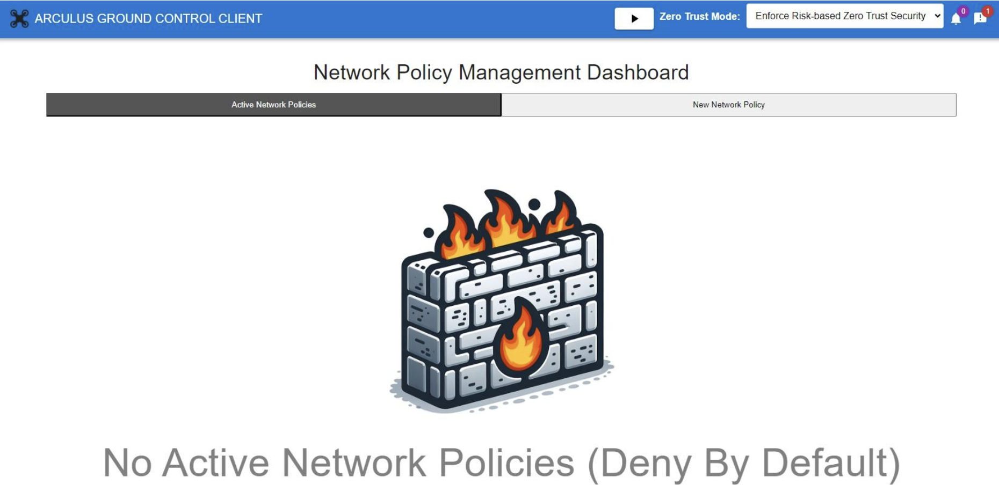

* Now, let us create a mission on the mission planning dashboard and execute it using the EXECUTE (▷) button on the “Missions created by me” tab. The mission starts executing within seconds and the application takes us to the “Mission Execution” tab where the live mission and its logs can be monitored.

 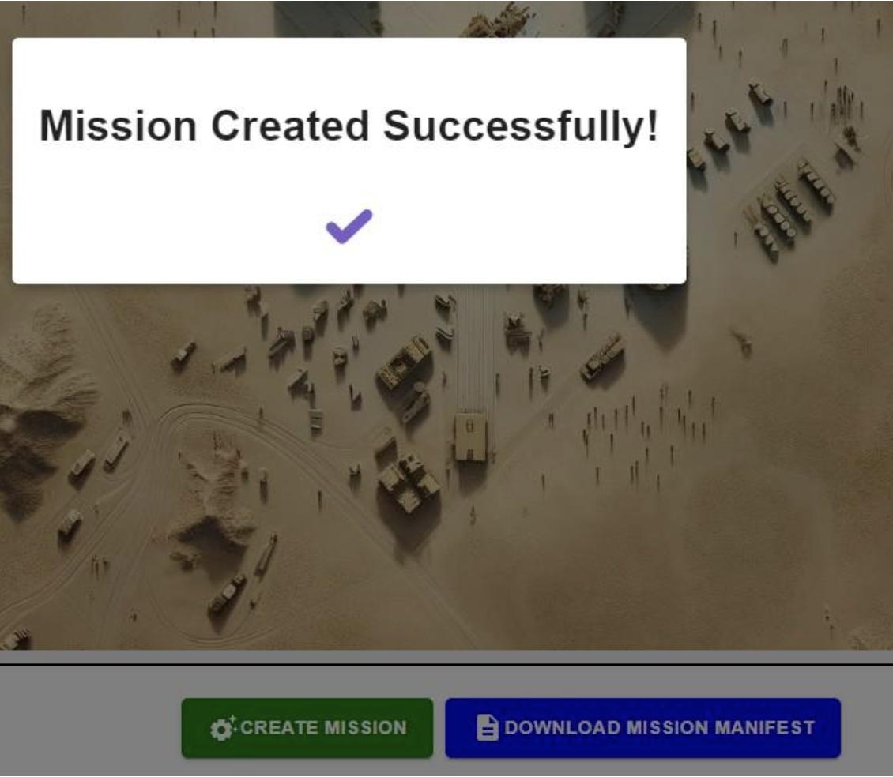

 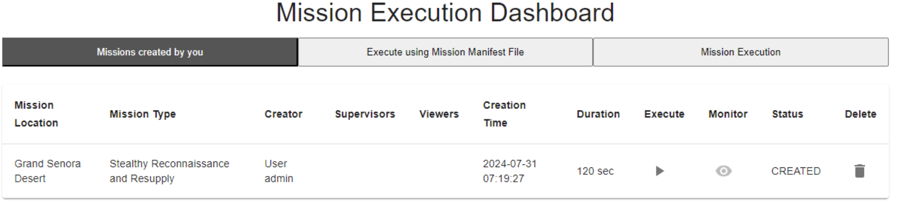

 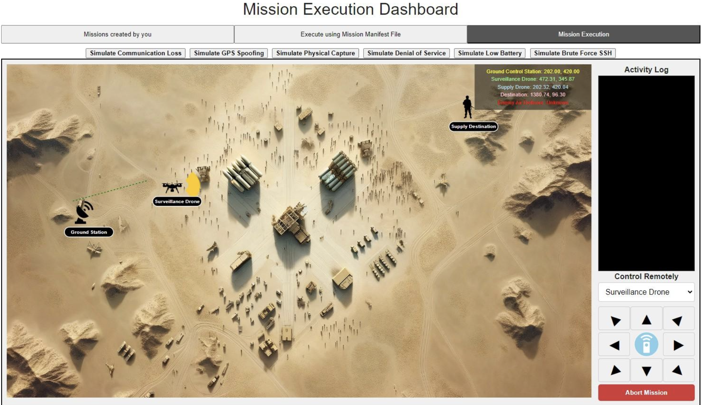

* It can be observer that, on navigating to the Network Policy Management Dashboard, new policies are created during the mission execution to facilitate communication for respective tasks. However, as soon as the mission execution finishes/terminates, all the network policies are deleted. This demonstrates the extraordinary and dynamic execution of Task-based Access Control (TBAC) for good privilege management for devices on the network.

 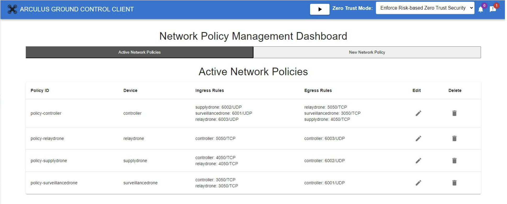

* By playing around with the simulation buttons provided on the Mission Execution Dashboard, we can explore the various zero trust capabilities and countermeasures taken by Arculus for secure and successful completion of missions under adverse conditions. These include DDIL scenarios like communication loss, GPS Spoofing attacks, physical hijacking, Denial of Service, Low battery, Brute force attacks, etc.

 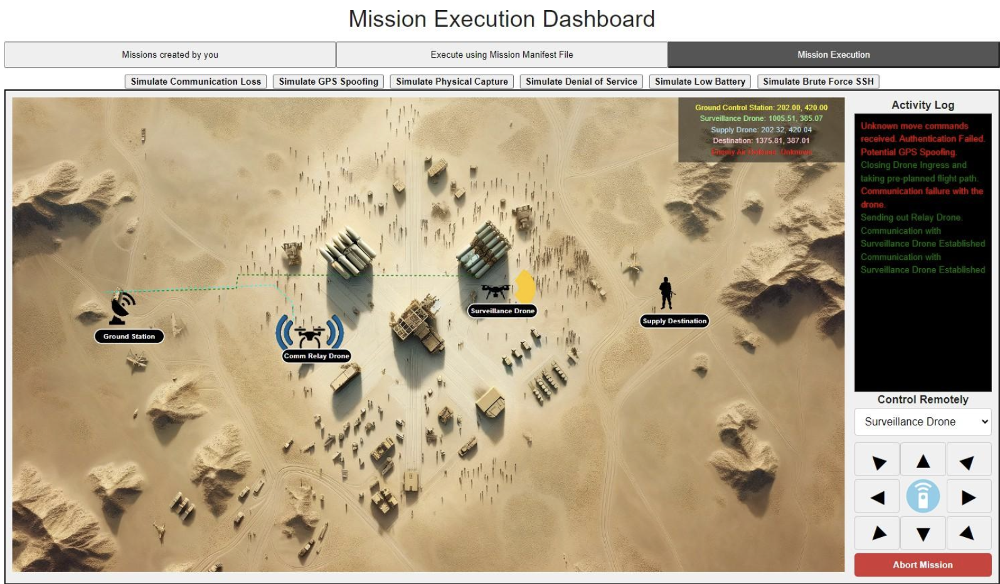

 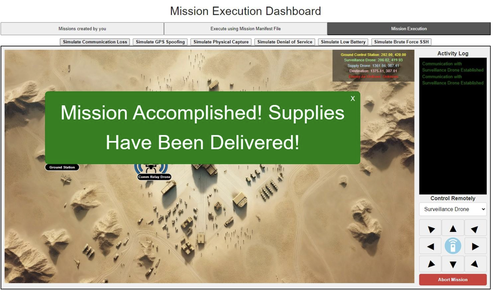

## 2.4 As a Result

By completing this chapter, you have executed the full mission lifecycle within the Arculus Zero-Trust testbed—from planning and validation to real-time execution and post-mission analysis. You learned how Arculus verifies device capabilities, enforces strict mission prerequisites, and protects mission files through encrypted manifests. During execution, you observed how Task-Based Access Control (TBAC) dynamically creates and removes network policies to ensure drones communicate only when permitted. You also experimented with DDIL and adversarial scenarios, demonstrating Arculus’ resilience under compromised conditions. At this stage, you have a complete understanding of how autonomous drone missions operate securely end-to-end in the Arculus environment, preparing you for more advanced workflows and system extensions in future modules.

