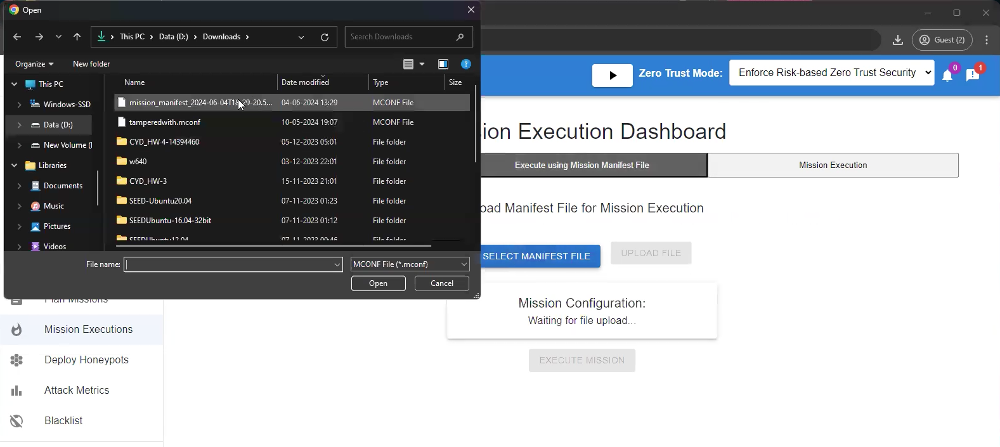
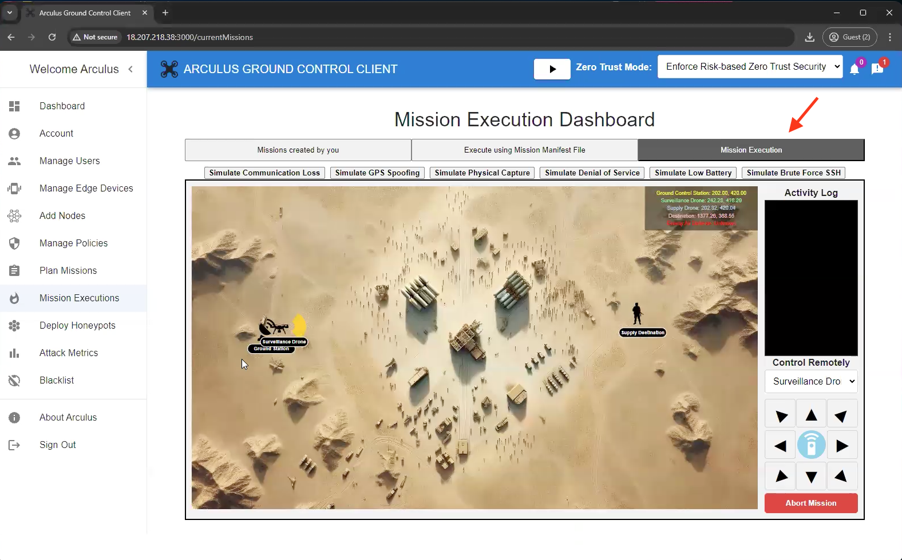
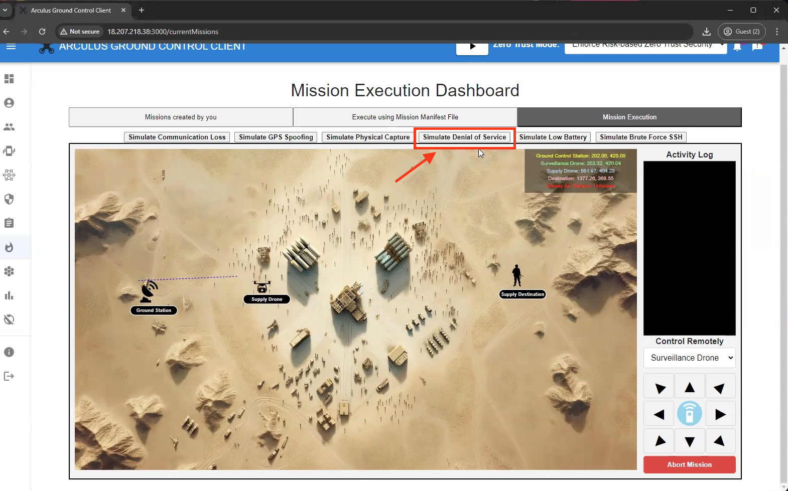
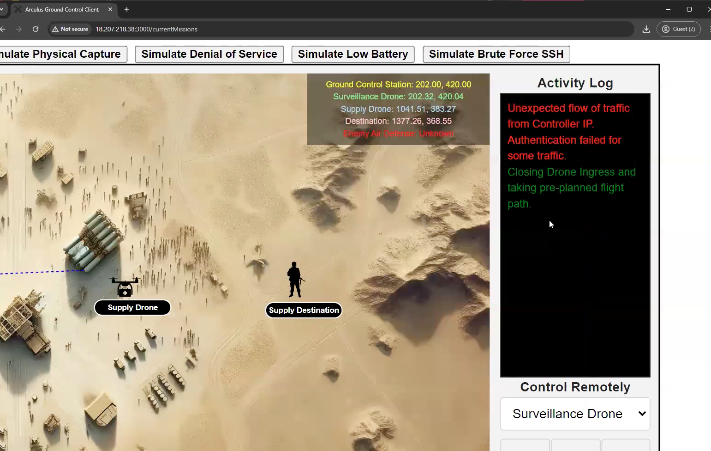
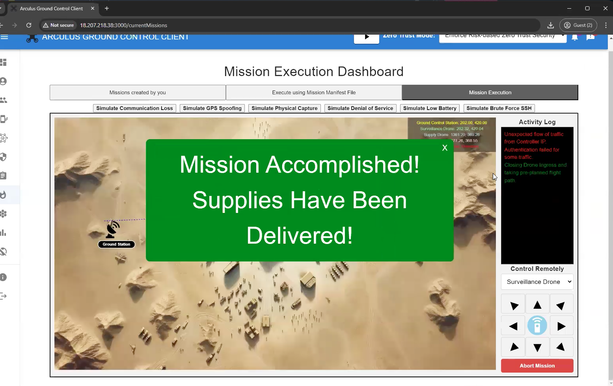

# Chapter 2 - Mission Execution

## 2.1 Overview

This chapter walks through the complete execution of Simulation Scenario 1: Denial of Service (DoS). In this demo, you will run a pre-configured simulation and observe how the system behaves under normal conditions and how that behavior changes when a DoS-style attack is introduced.

The objective of this chapter is to execute the simulation end-to-end and observe the impact on system availability and responsiveness. No configuration changes or defensive actions are required.

## 2.2 Preparing the Environment

Before starting the simulation, ensure that:

* The simulation environment is running and accessible
* All required services are in a normal operational state
* The previously downloaded manifest file still exist to use for this lab

At this stage, the system should be stable and responsive.

## 2.3 Mission Execution

In this step, you will execute the mission that was previously created and validated. Mission execution is performed through the Mission Execution Dashboard, which allows you to launch, monitor, and observe mission behavior during runtime.

* Begin by navigating to the Mission Executions section within the Arculus portal. This section provides a centralized view of all missions available for execution, along with their current status and metadata.
* Once inside the Mission Execution Dashboard, you will see a list of missions that have already been created. Each mission entry includes details such as the mission location, mission type, creator, duration, and execution status.

 

* Click on to **Planning Mission Dashboard.**
* To initiate mission execution, select the option to Execute using Mission Manifest File. This action instructs the system to load the validated mission manifest and begin executing the mission according to the defined parameters and constraints.

 

* Select the previously used **Manifest File.**

 

 

* Upon uploading the file, click **Execute Mission**
* After selecting the mission for execution, the system transitions the mission from a configured state into an active runtime state. During this phase, Arculus enforces mission-level policies and ensures that only authorized components participate in execution.

 

* Click on **Mission Execution Dashboard** for the simulation

 

* Running the simulation

 

* Above, navigate and click **Simulate Denial of Service.**

 
 

* On the right side, view the activity log as the simulation runs.

 

* Upon the results of the activity log, the mission will come to a complete.

 

