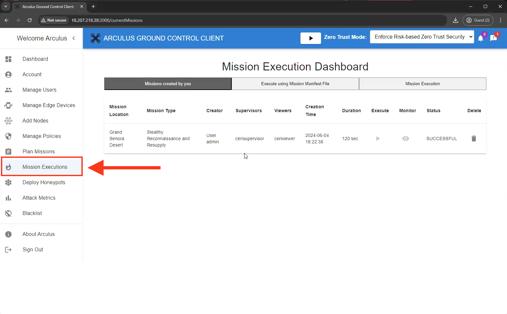
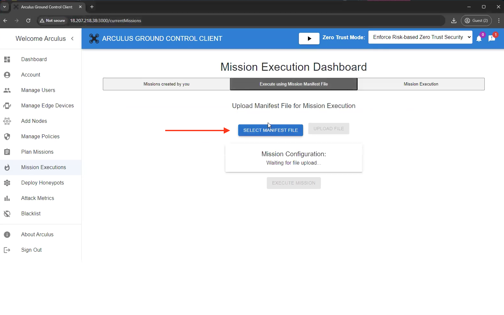
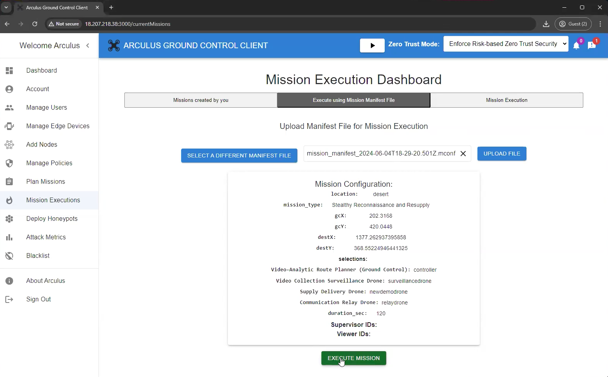
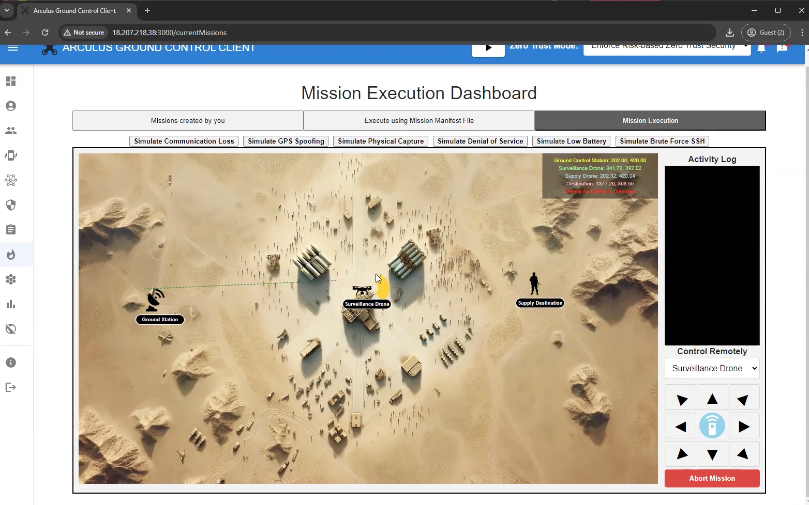
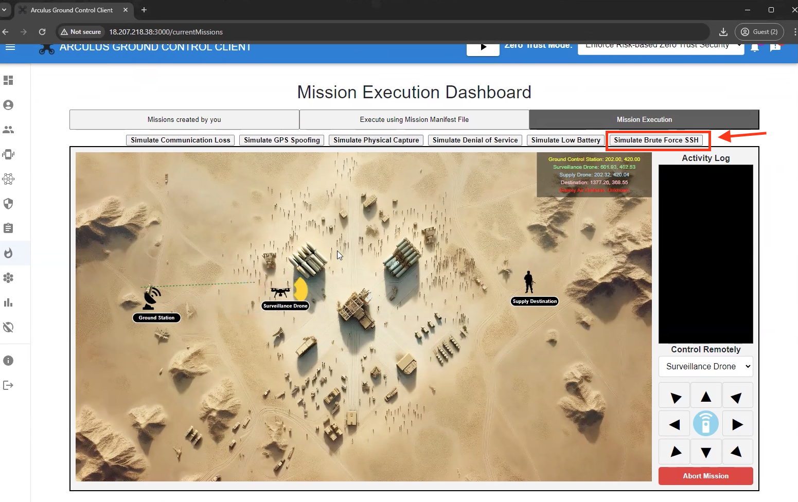
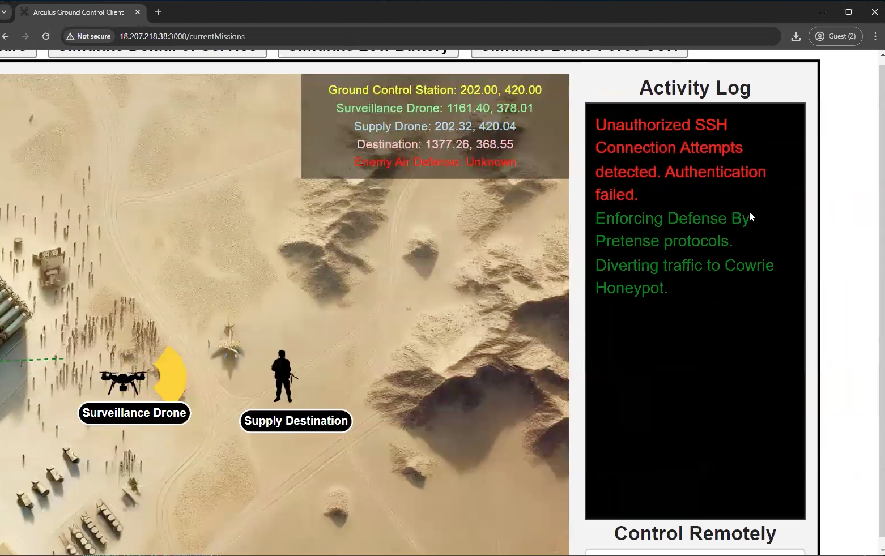
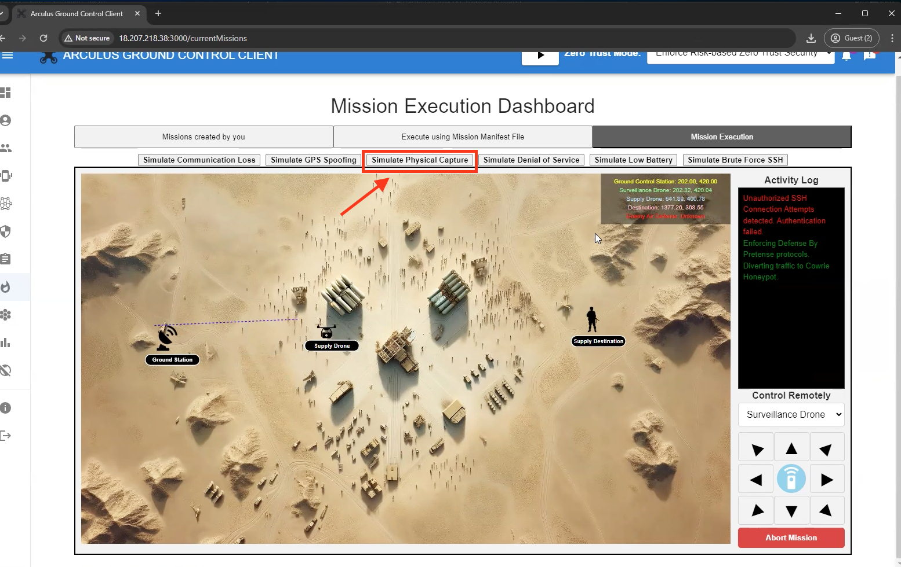
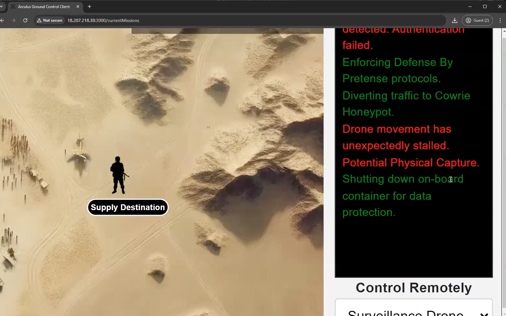
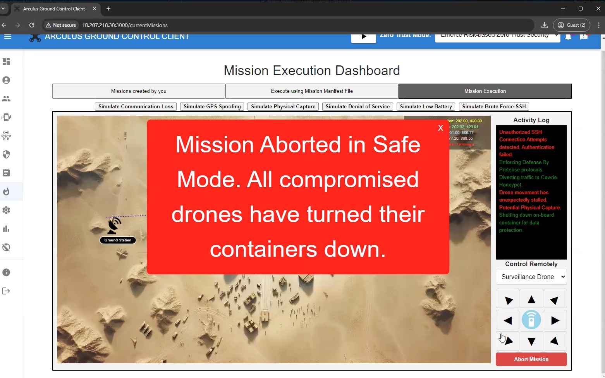
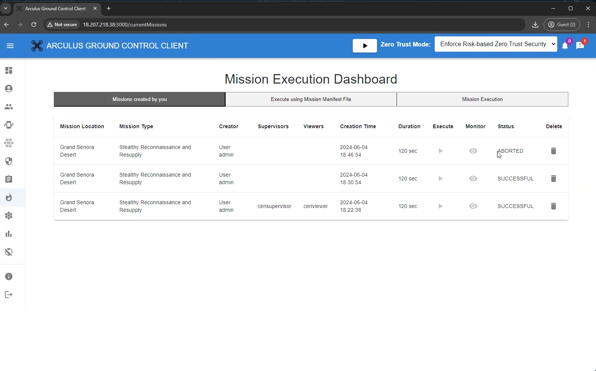

# Chapter 2

## 2.1 Overview

This chapter walks through the execution of Simulation Scenario 2: Disruption by Brute Force and Physical Capture. In this demo, you will run a pre-configured mission and introduce adversarial conditions that simulate brute force access attempts and physical capture events.

The objective of this chapter is to observe how the system behaves when mission execution is disrupted through unauthorized access attempts and physical compromise. No configuration changes or defensive actions are required.

## 2.2 Preparing the Environment

Before starting the simulation, ensure that:
* The simulation environment is running and accessible
* The mission is visible within the Mission Execution Dashboard
* All mission components are operating normally

At this stage, the system should be stable and ready for execution.

## 2.3 Mission Execution

In this step, you will execute the mission that was previously created and validated. Mission execution is performed through the Mission Execution Dashboard, which allows you to launch, monitor, and observe mission behavior during runtime.

* Begin by navigating to the Mission Executions section within the Arculus portal. This section provides a centralized view of all missions available for execution, along with their current status and metadata.
* Once inside the Mission Execution Dashboard, you will see a list of missions that have already been created. Each mission entry includes details such as the mission location, mission type, creator, duration, and execution status.

 

* Click on to **Planning Mission Dashboard.**
* To initiate mission execution, select the option to Execute using Mission Manifest File. This action instructs the system to load the validated mission manifest and begin executing the mission according to the defined parameters and constraints.

 

* Select the previously used **Manifest File.**

 

 

* Upon uploading the file, click **Execute Mission**
* After selecting the mission for execution, the system transitions the mission from a configured state into an active runtime state. During this phase, Arculus enforces mission-level policies and ensures that only authorized components participate in execution.

 

* After initiating the mission, navigate to the **Mission Execution Dashboard** to observe the live simulation.
* The Mission Execution Dashboard provides a real-time visualization of the mission environment, including drone positions, movement, and operational context. The interface allows you to monitor mission progress as it unfolds and observe how the system responds during execution.

 

* **Running the simulation**
* Once the mission is actively running in the Mission Execution Dashboard, the simulation environment becomes fully interactive. At this stage, all mission entities are visible on the map, and the system is operating under normal mission conditions.
* Before introducing any disruptions, observe the baseline behavior of the mission. Confirm that drones are following their assigned paths and that mission progress appears stable.

 

* To initiate the Brute Force scenario, navigate to the simulation controls at the top of the Mission Execution Dashboard. From the available simulation options, select **Simulate Brute Force SSH**. This action introduces a Brute Force condition into the active mission environment.

 
 

* As the simulation runs, you can view the activity logs.

 
 

* Next, let's initiate the physical capture scenario. From the available simulation options, select **Simulate Physical Capture**.

 
 

* Now, view the logs and see the reading accordingly as the simulation runs.

 
 

* Upon reading and understanding the logs, click on **Abort Mission** which is available in the lower right corner.

 
 

* Navigate back to the Mission Execution dashboard to see the status of the mission.

 
 

