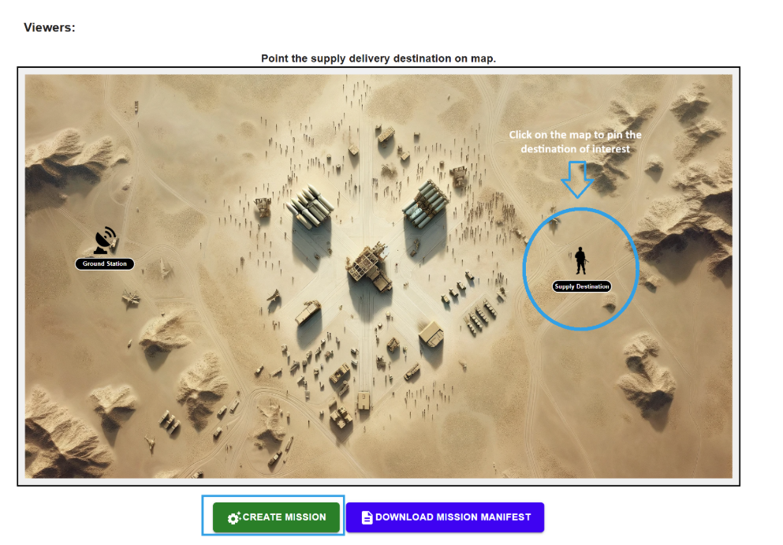

# Chapter 2

## 2.1 Overview

This chapter walks through the execution of Simulation Scenario 2: Disruption by Brute Force and Physical Capture. In this demo, you will run a pre-configured mission and introduce adversarial conditions that simulate brute force access attempts and physical capture events.

The objective of this chapter is to observe how the system behaves when mission execution is disrupted through unauthorized access attempts and physical compromise. No configuration changes or defensive actions are required.

## 2.2 Mission Planning

* The Mission Planning Dashboard allows for configuring drone missions by specifying which devices to use, what the context (criticality) of the mission is, who the supervisors and viewers of the mission are, and logistics information. Let us first pick the mission type by navigating to the Mission Planning page as shown in the image below and selecting "Stealthy Reconnaissance and Resupply" mission type to begin configuring the mission.

 

* From the page as shown below, select the appropriate drone you will be using for various tasks such as surveillance, supply, etc. Also select the criticality. For this exercise, you can choose any settings or leave them as default.

 

* Scroll down from the page to view the map. You will use your mouse to pin a supply destination to deliver the supplies. As it shows in the image below, you will see a pinned destination (encircled in image.)

 

* Once the location is set, click on the "Create Mission" button to create the mission. Next we will execute the mission and perform some actions to simulate the Low battery capacity scenario.

## 2.3 Mission Execution

In this step, you will execute the mission that was previously created and validated. Mission execution is performed through the Mission Execution Dashboard, which allows you to launch, monitor, and observe mission behavior during runtime.

* After initiating the mission, navigate to the **Mission Execution Dashboard** to observe the live simulation.
* The Mission Execution Dashboard provides a real-time visualization of the mission environment, including drone positions, movement, and operational context. The interface allows you to monitor mission progress as it unfolds and observe how the system responds during execution.

 

* **Running the simulation**
* Once the mission is actively running in the Mission Execution Dashboard, the simulation environment becomes fully interactive. At this stage, all mission entities are visible on the map, and the system is operating under normal mission conditions.
* Before introducing any disruptions, observe the baseline behavior of the mission. Confirm that drones are following their assigned paths and that mission progress appears stable.

 

* To initiate the brute force disruption scenario, navigate to the simulation controls located at the top of the Mission Execution Dashboard. From the available simulation options, select Simulate Brute Force SSH. This action introduces a brute force access attempt into the active mission environment.

 
 

* Once enabled, the system begins generating repeated unauthorized SSH connection attempts targeting mission components. These attempts simulate an adversary trying to gain access through credential guessing or repeated authentication failures while the mission is actively running.

* As the simulation progresses, monitor the Activity Log displayed on the right side of the dashboard. The activity log records real-time system events related to authentication failures and security enforcement actions. Log messages indicate detection of unauthorized SSH attempts and reflect how the system responds under these conditions.

 
 

* After observing the effects of the brute force access attempt, the next step is to simulate a physical capture event. With the mission still running, navigate to the simulation controls at the top of the Mission Execution Dashboard and select **Simulate Physical Capture**.

 
 

* This action introduces a physical compromise scenario into the active mission environment. The simulation represents a situation where a mission asset is physically intercepted or disabled during operation.
* On the right-hand side of the dashboard, review the Activity Log as new entries appear. The activity log records detection of the physical capture condition and documents the system’s response. Log messages indicate that mission execution has been disrupted and that protective actions are being taken to safeguard sensitive data.

 
 

* Upon reading and understanding the logs, click on **Abort Mission** which is available in the lower right corner.

 
 

* Navigate back to the Mission Execution dashboard to see the status of the mission.

 
 

## 2.4 As a Result

In this chapter, you executed a mission and introduced disruption scenarios through brute force access attempts and physical capture. By observing activity logs and system behavior, you saw how the mission responded to unauthorized access and physical compromise during live execution. The mission was ultimately aborted in safe mode, demonstrating how the system prioritizes data protection and controlled shutdown when mission integrity is at risk. This scenario highlights the importance of security-aware execution and safe termination in adversarial mission environments.

