# Chapter 2

## 2.1 Overview 

This chapter walks through the execution of Simulation Scenario 3: Intermittent Connectivity. In this demo, you will run a pre-configured mission and introduce intermittent communication disruptions during active execution.

The objective of this chapter is to observe how the system behaves when connectivity becomes unstable and how mission execution is affected during periods of reduced or lost communication. No configuration changes or defensive actions are required.

## 2.2 Mission Planning

* The Mission Planning Dashboard allows for configuring drone missions by specifying which devices to use, what the context (criticality) of the mission is, who the supervisors and viewers of the mission are, and logistics information. Let us first pick the mission type by navigating to the Mission Planning page as shown in the image below and selecting "Stealthy Reconnaissance and Resupply" mission type to begin configuring the mission.

 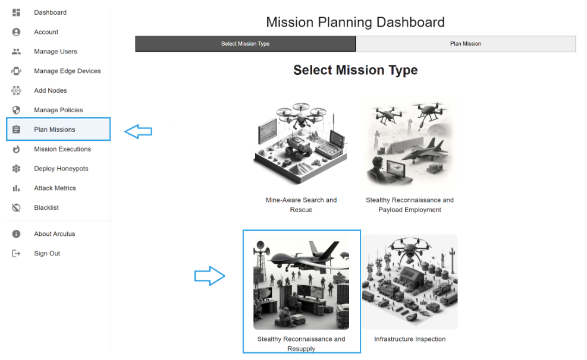

* From the page as shown below, select the appropriate drone you will be using for various tasks such as surveillance, supply, etc. Also select the criticality. For this exercise, you can choose any settings or leave them as default.

 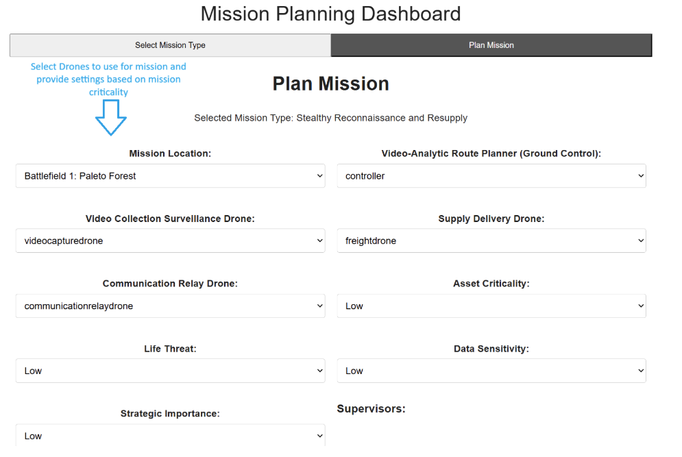

* Scroll down from the page to view the map. You will use your mouse to pin a supply destination to deliver the supplies. As it shows in the image below, you will see a pinned destination (encircled in image.)

 

* Once the location is set, click on the "Create Mission" button to create the mission. Next we will execute the mission and perform some actions to simulate the Low battery capacity scenario.

## 2.3 Mission Execution

In this step, you will execute the mission that was previously created and validated. Mission execution is performed through the Mission Execution Dashboard, which allows you to launch, monitor, and observe mission behavior during runtime.

* After initiating the mission, navigate to the **Mission Execution Dashboard** to observe the live simulation.
* The Mission Execution Dashboard provides a real-time visualization of the mission environment, including drone positions, movement, and operational context. The interface allows you to monitor mission progress as it unfolds and observe how the system responds during execution.

 

### 2.3.1 Running the simulation

* Once the mission is actively running in the Mission Execution Dashboard, the simulation environment becomes fully interactive. At this stage, all mission entities are visible on the map, and the system is operating under normal mission conditions.
* Before introducing any disruptions, observe the baseline behavior of the mission. Confirm that drones are following their assigned paths and that mission progress appears stable.

 

* On the top left, click on **Simulate Communication Loss** 

 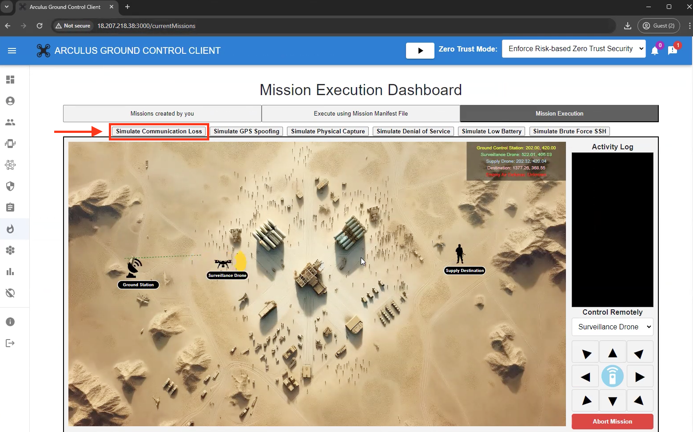

* As the mission executes, observe the simulation as communication between the ground station and the surveillance drone becomes unavailable. This represents an intermittent connectivity condition where direct communication cannot be maintained.
* When the communication loss is detected, the system automatically deploys the **communication relay** drone. The relay drone acts as an intermediary bridge, restoring communication between the surveillance drone and the ground station.

 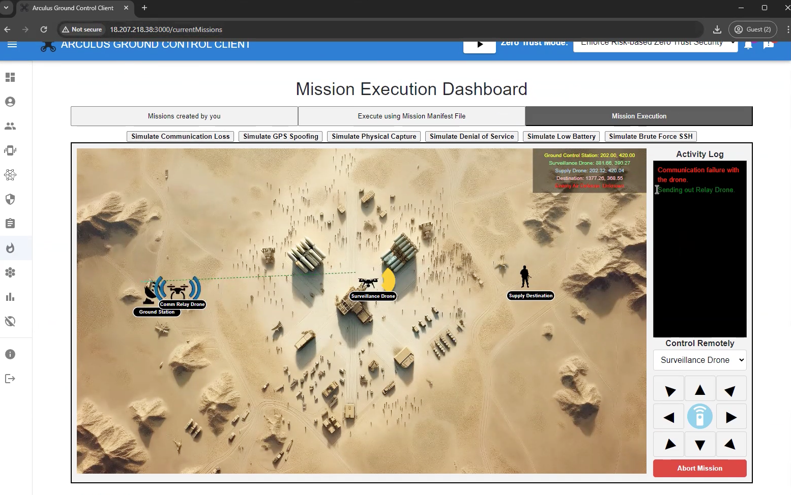

* Based on the drone simulation, it will come back as the relay drone stands as a bridge.

 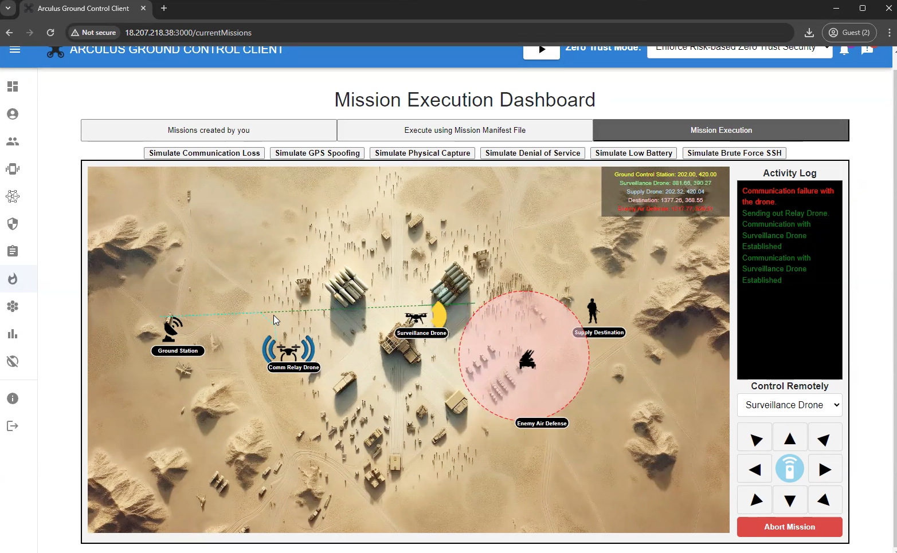

* Next, from the simulation controls located at the top of the Mission Execution Dashboard, select **Simulate GPS Spoofing**
* This action introduces a GPS spoofing condition while the mission is still running under intermittent connectivity. The simulation represents an adversarial attempt to manipulate or distort the location data received by the surveillance drone.

 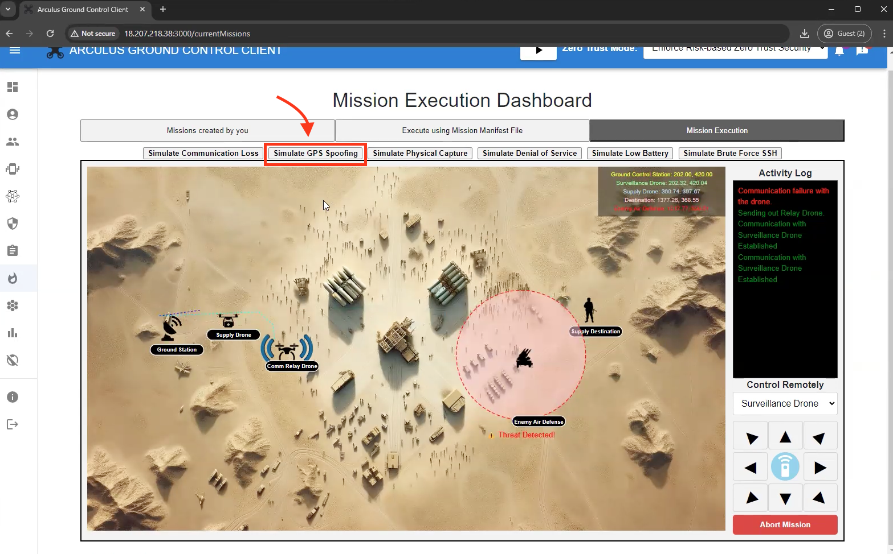

* As the simulation continues, closely monitor the Activity Log on the right-hand side of the dashboard.
* These log entries provide visibility into how the system identifies connectivity disruptions and responds to abnormal navigation data during mission execution.

 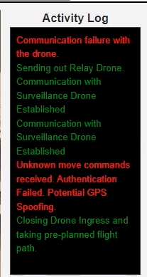

* As GPS spoofing is introduced, observe the behavior of the surveillance drone on the mission map.
* You will notice that the surveillance drone changes its trajectory in response to the detected GPS anomaly. This behavior indicates that the system has identified unreliable location data and has taken corrective action by adjusting movement to follow a predefined or safer flight path.

 

 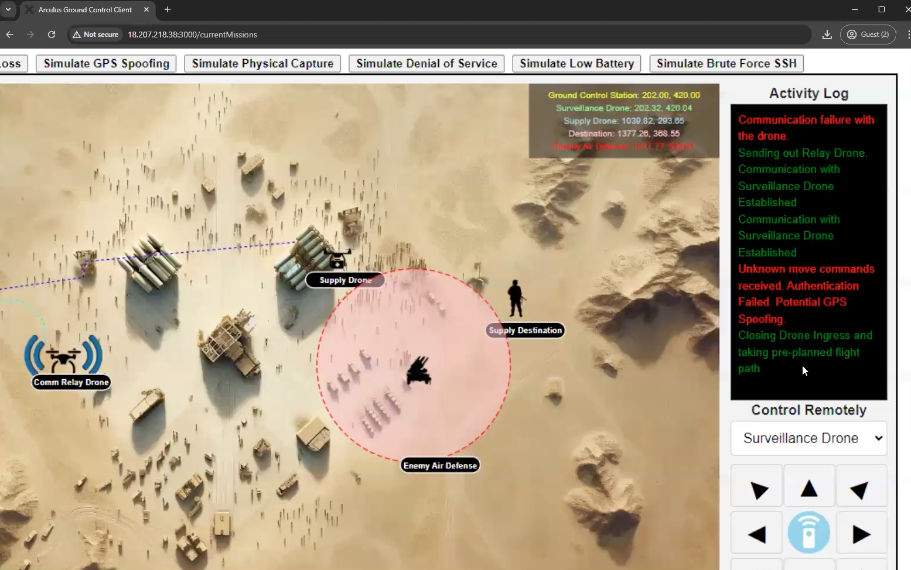

* Despite intermittent communication loss and navigation interference, the mission continues executing under predefined constraints. Observe how the system maintains operational progress by relying on autonomous decision-making and fallback behaviors.

 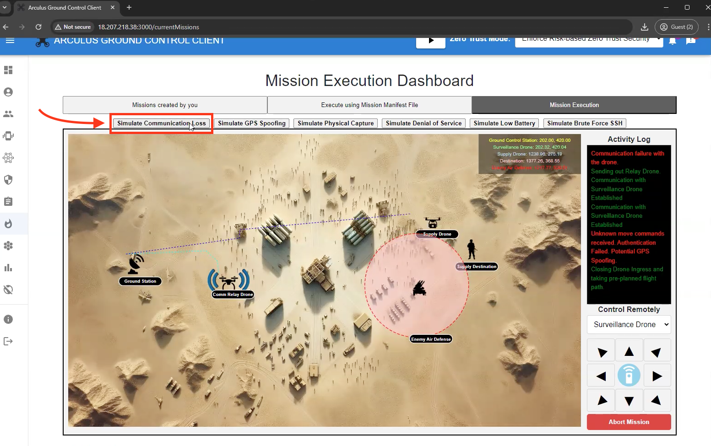

* The surveillance and supply drones continue executing their assigned roles while adapting to degraded communication conditions. This phase highlights how mission execution does not immediately halt when connectivity becomes unreliable.

 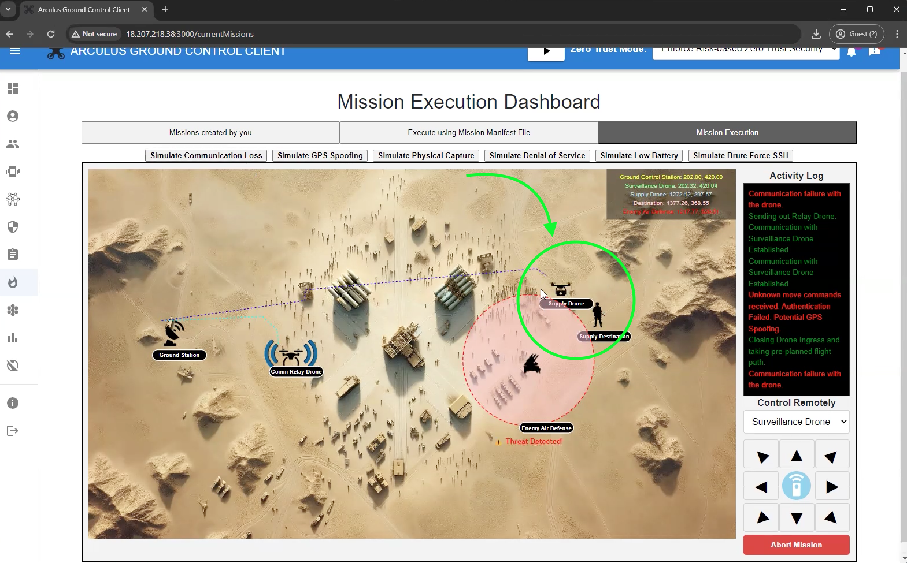

* As the mission reaches completion, observe the final system notification indicating successful mission execution.
* The Mission Accomplished message confirms that supplies have been delivered despite intermittent connectivity and navigation disruptions. This outcome demonstrates the system’s ability to complete mission objectives under degraded network conditions.

 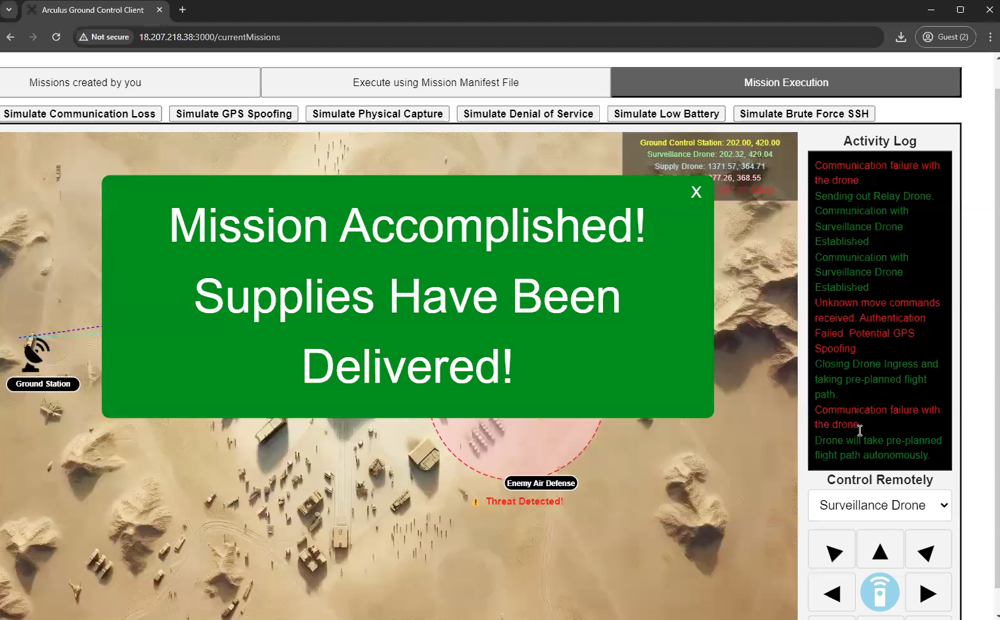

## 2.4 As a Result

As a result of this simulation, you observed how mission execution adapts to intermittent connectivity and navigation disruptions during live operations. The system detected communication loss, automatically deployed a relay drone to restore connectivity, and adjusted mission behavior when GPS spoofing was identified. Despite degraded network conditions and unreliable navigation signals, the mission continued executing under predefined constraints and successfully completed its objective. This scenario demonstrates how autonomous decision-making and adaptive communication mechanisms enable mission continuity in environments with unstable connectivity.