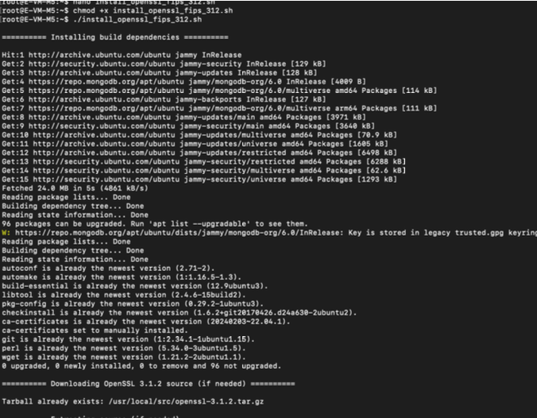
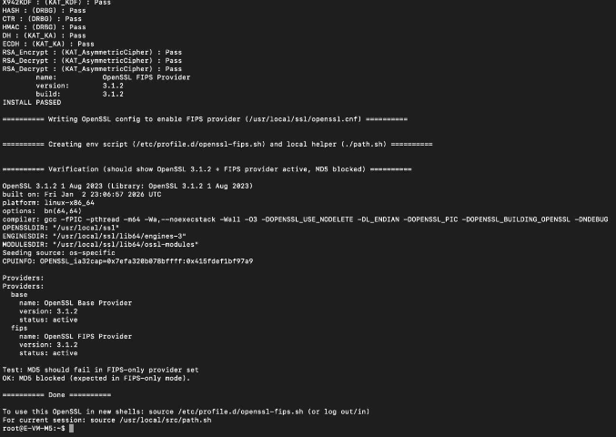
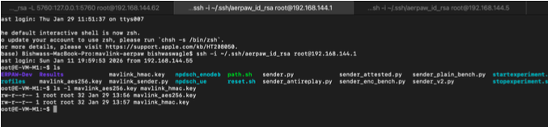
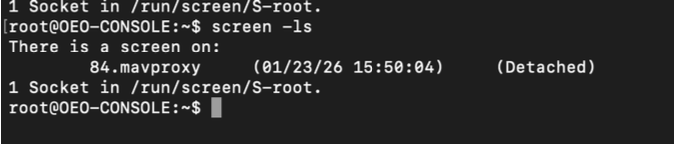

# Chapter 3 — Cryptographic Infrastructure Setup

## 3.1 Overview

In this chapter, you will establish the cryptographic foundation necessary for securing MAVLink communications. This involves installing OpenSSL with FIPS (Federal Information Processing Standards) validation, which ensures that the cryptographic implementations meet rigorous security standards established by the U.S. government.

FIPS-validated cryptography is essential for security-critical applications. FIPS 140-2 certification ensures that cryptographic modules have been tested and validated to meet specific security requirements. By using FIPS-validated OpenSSL, you guarantee that the encryption protecting your drone commands meets industry-recognized security standards.

This chapter will guide you through installing OpenSSL 3.1.2 with FIPS module support, generating cryptographic keys for AES-256-GCM encryption and HMAC-SHA256 authentication, and securely distributing these keys between the ground control station and the drone.

By completing this chapter, you will have a fully functional cryptographic infrastructure ready to protect MAVLink navigation commands from spoofing attacks.

## 3.2 Prerequisites

Before starting this chapter, ensure that:

* You have root access to both the drone and base station nodes
* The AERPAW environment is properly configured (Chapter 2 completed)
* You are familiar with basic Linux command-line operations
* You understand the difference between encryption (confidentiality) and authentication (integrity)

## 3.3 Understanding FIPS-Validated Cryptography

### 3.3.1 What is FIPS 140-2?

FIPS 140-2 (Federal Information Processing Standards Publication 140-2) is a U.S. government standard that specifies security requirements for cryptographic modules. It ensures that:

* Cryptographic algorithms are implemented correctly
* Key management is performed securely
* The module has been independently tested and validated
* Physical and logical security boundaries are maintained

### 3.3.2 Why FIPS Matters for UAV Security

For unmanned aerial vehicles operating in security-sensitive environments:

* **Regulatory Compliance**: Government and military applications often require FIPS validation
* **Assured Security**: FIPS validation provides confidence that cryptographic implementations are correct
* **Attack Resistance**: FIPS-validated modules are tested against known cryptographic attacks
* **Interoperability**: FIPS provides a common security baseline across different systems

### 3.3.3 Cryptographic Components

This experiment uses two cryptographic mechanisms:

* **AES-256-GCM**: Advanced Encryption Standard with 256-bit keys in Galois/Counter Mode
  * Provides confidentiality (encryption)
  * Provides integrity (authentication)
  * Resistant to tampering and forgery
  
* **HMAC-SHA256**: Hash-based Message Authentication Code using SHA-256
  * Provides message authentication
  * Prevents unauthorized command modification
  * Complements AES-GCM for defense-in-depth

## 3.4 Installing OpenSSL with FIPS Module

### 3.4.1 Access the Drone Node

SSH into the drone node where the cryptographic setup will be performed:

```bash
ssh -i ~/.ssh/aerpaw_id_rsa root@192.168.144.5
```

### 3.4.2 Create Installation Script

The installation script automates the process of building OpenSSL with FIPS support. Create the script as follows:

```bash
cat > /root/install_openssl_fips_312.sh << 'EOF'
#!/usr/bin/env bash
set -euo pipefail

# OpenSSL FIPS build/install script (3.1.2)
# Installs to /usr/local/ssl
# Generates: /usr/local/ssl/fipsmodule.cnf and /usr/local/ssl/openssl.cnf
# Creates: /etc/profile.d/openssl-fips.sh (env vars) and ./path.sh (local helper)

OPENSSL_VER="3.1.2"
SRC_DIR="/usr/local/src"
PREFIX="/usr/local/ssl"
OPENSSLDIR="/usr/local/ssl"
TARBALL="openssl-${OPENSSL_VER}.tar.gz"
URL="https://www.openssl.org/source/${TARBALL}"

# ---- helpers ----
die() { echo "ERROR: $*" >&2; exit 1; }
need_root() { [[ "${EUID}" -eq 0 ]] || die "Run as root (use sudo)."; }

echo_step() { echo -e "\n========== $* ==========\n"; }

# ---- main ----
need_root

echo_step "Installing build dependencies"
apt update
apt install -y build-essential checkinstall git perl \
    libtool automake autoconf pkg-config wget ca-certificates

mkdir -p "${SRC_DIR}"
cd "${SRC_DIR}"

echo_step "Downloading OpenSSL ${OPENSSL_VER} source (if needed)"
if [[ ! -f "${TARBALL}" ]]; then
    wget -O "${TARBALL}" "${URL}"
else
    echo "Tarball already exists: ${SRC_DIR}/${TARBALL}"
fi

echo_step "Extracting source (if needed)"
if [[ ! -d "openssl-${OPENSSL_VER}" ]]; then
    tar -xf "${TARBALL}"
else
    echo "Source directory already exists: ${SRC_DIR}/openssl-${OPENSSL_VER}"
fi

cd "openssl-${OPENSSL_VER}"

echo_step "Configuring OpenSSL with FIPS (static build)"
./Configure enable-fips no-shared --prefix="${PREFIX}" --openssldir="${OPENSSLDIR}"

echo_step "Building"
make -j"$(nproc)"

echo_step "Installing to ${PREFIX}"
make install

# Detect lib directory (some systems use lib64)
LIBDIR="${PREFIX}/lib"
MODULEDIR="${LIBDIR}/ossl-modules"
if [[ -d "${PREFIX}/lib64" ]]; then
    if [[ -d "${PREFIX}/lib64/ossl-modules" ]]; then
        LIBDIR="${PREFIX}/lib64"
        MODULEDIR="${LIBDIR}/ossl-modules"
    fi
fi

[[ -d "${MODULEDIR}" ]] || die "Module directory not found: ${MODULEDIR}"
[[ -f "${MODULEDIR}/fips.so" ]] || die "FIPS module not found: ${MODULEDIR}/fips.so"

echo_step "Running fipsinstall (generates fipsmodule.cnf + runs self-tests)"
"${PREFIX}/bin/openssl" fipsinstall \
    -out "${PREFIX}/fipsmodule.cnf" \
    -module "${MODULEDIR}/fips.so"

echo_step "Writing OpenSSL config to enable FIPS provider (${PREFIX}/openssl.cnf)"
cat > "${PREFIX}/openssl.cnf" <<'EOFCONF'
openssl_conf = openssl_init

.include /usr/local/ssl/fipsmodule.cnf

[openssl_init]
providers = provider_sect

[provider_sect]
base = base_sect
fips = fips_sect

[base_sect]
activate = 1

[fips_sect]
activate = 1
EOFCONF

echo_step "Creating env script (/etc/profile.d/openssl-fips.sh) and local helper (./path.sh)"
cat > /etc/profile.d/openssl-fips.sh <<EOFENV
# OpenSSL 3.1.2 FIPS environment
export PATH=${PREFIX}/bin:\$PATH
export LD_LIBRARY_PATH=${LIBDIR}:\$LD_LIBRARY_PATH
export OPENSSL_MODULES=${MODULEDIR}
export OPENSSL_CONF=${PREFIX}/openssl.cnf
EOFENV
chmod 0644 /etc/profile.d/openssl-fips.sh

cat > "${SRC_DIR}/path.sh" <<EOFPATH
#!/usr/bin/env bash
export PATH=${PREFIX}/bin:\$PATH
export LD_LIBRARY_PATH=${LIBDIR}:\$LD_LIBRARY_PATH
export OPENSSL_MODULES=${MODULEDIR}
export OPENSSL_CONF=${PREFIX}/openssl.cnf
echo "Environment set:"
echo " PATH=\$PATH"
echo " LD_LIBRARY_PATH=\$LD_LIBRARY_PATH"
echo " OPENSSL_MODULES=\$OPENSSL_MODULES"
echo " OPENSSL_CONF=\$OPENSSL_CONF"
EOFPATH
chmod +x "${SRC_DIR}/path.sh"

echo_step "Verification (should show OpenSSL 3.1.2 + FIPS provider active, MD5 blocked)"
"${PREFIX}/bin/openssl" version -a

# Load config/env for checks in current shell
export PATH="${PREFIX}/bin:${PATH}"
export LD_LIBRARY_PATH="${LIBDIR}:${LD_LIBRARY_PATH:-}"
export OPENSSL_MODULES="${MODULEDIR}"
export OPENSSL_CONF="${PREFIX}/openssl.cnf"

echo ""
echo "Providers:"
openssl list -providers

echo ""
echo "Test: MD5 should fail in FIPS-only provider set"
set +e
openssl md5 <<< "test" >/dev/null 2>&1
MD5_RC=$?
set -e
if [[ "${MD5_RC}" -eq 0 ]]; then
    echo "WARNING: MD5 succeeded. That usually means default provider is enabled somewhere."
    echo "Check OPENSSL_CONF=${OPENSSL_CONF} and providers output."
else
    echo "OK: MD5 blocked (expected in FIPS-only mode)."
fi

echo_step "Done"
echo "To use this OpenSSL in new shells: source /etc/profile.d/openssl-fips.sh (or log out/in)"
echo "For current session: source ${SRC_DIR}/path.sh"
EOF
```

Make the script executable and run it:

```bash
chmod +x /root/install_openssl_fips_312.sh
/root/install_openssl_fips_312.sh
```

The script will:

1. Install required build dependencies
2. Download OpenSSL 3.1.2 source code
3. Configure the build with FIPS module enabled
4. Compile OpenSSL (this step takes the longest time)
5. Install to `/usr/local/ssl`
6. Run FIPS self-tests
7. Configure environment variables

<p align="center">  </p>

### 3.4.3 Verify Installation

After installation completes, verify that FIPS-validated OpenSSL is properly installed:

```bash
source /etc/profile.d/openssl-fips.sh
which openssl
openssl version -a
openssl list -providers
```

<p align="center">  </p>

Expected output should show:

* OpenSSL 3.1.2 installation path
* FIPS provider listed and active
* Base provider listed and active

### 3.4.4 Test FIPS Enforcement

Verify that FIPS mode is enforcing security policies by testing a non-FIPS-approved algorithm:

```bash
echo "test" | openssl md5
```

This command should **fail** with an error message, indicating that MD5 (which is not FIPS-approved) is blocked. This confirms that FIPS enforcement is active.

## 3.5 Generating Cryptographic Keys

With FIPS-validated OpenSSL installed, you can now generate the cryptographic keys needed for securing MAVLink communications.

### 3.5.1 Generate AES-256 Encryption Key

Generate a 256-bit (32-byte) random key for AES encryption:

```bash
cd /root
openssl rand -out mavlink_aes256.key 32
```

This key will be used to encrypt navigation commands, ensuring confidentiality.

### 3.5.2 Generate HMAC Authentication Key

Generate a 256-bit (32-byte) random key for HMAC authentication:

```bash
openssl rand -out mavlink_hmac.key 32
```

This key will be used to authenticate commands, ensuring integrity and preventing tampering.

### 3.5.3 Verify Key Generation

Confirm that both keys were generated successfully:

```bash
ls -l mavlink_aes256.key mavlink_hmac.key
wc -c mavlink_aes256.key mavlink_hmac.key
```

<p align="center">  </p>

Each key should be exactly 32 bytes in size.

### 3.5.4 Set Appropriate Permissions

Protect the keys with restrictive file permissions:

```bash
chmod 600 mavlink_aes256.key mavlink_hmac.key
```

This ensures only the root user can read the keys.

## 3.6 Distributing Keys to Base Station

For the base station to send encrypted commands, it must have copies of the cryptographic keys.

### 3.6.1 Copy Keys from Drone to Base Station

From your local machine, use SCP to transfer the keys from the drone to the base station:

```bash
scp -i ~/.ssh/aerpaw_id_rsa root@192.168.144.5:/root/mavlink_aes256.key \
    root@192.168.144.1:/root/

scp -i ~/.ssh/aerpaw_id_rsa root@192.168.144.5:/root/mavlink_hmac.key \
    root@192.168.144.1:/root/
```

### 3.6.2 Verify Keys on Base Station

SSH into the base station and verify the keys are present:

```bash
ssh -i ~/.ssh/aerpaw_id_rsa root@192.168.144.1
ls -l mavlink_aes256.key mavlink_hmac.key
```

<p align="center">  </p>

Both keys should be present with 32-byte sizes.

## 3.7 Security Considerations

### 3.7.1 Key Management Best Practices

In production environments, consider:

* **Secure Key Generation**: Keys should be generated on secure systems with good entropy sources
* **Key Distribution**: Use secure channels (e.g., encrypted USB drives, secure network transfers)
* **Key Storage**: Store keys encrypted at rest when possible
* **Key Rotation**: Periodically generate new keys and retire old ones
* **Access Control**: Limit key access to only authorized personnel and systems

### 3.7.2 FIPS Compliance

When deploying in regulated environments:

* Always use FIPS-validated cryptographic modules
* Ensure FIPS mode is enabled and enforced
* Document cryptographic key lifecycle
* Perform regular security audits
* Maintain logs of cryptographic operations

### 3.7.3 Limitations of Software-Based Security

Software-based cryptography has limitations:

* Keys stored in memory can potentially be extracted
* No hardware-backed secure element protects keys
* System compromise could expose keys

For higher security requirements, consider hardware security modules (HSMs) or trusted platform modules (TPMs).

## 3.8 Troubleshooting

### Issue: OpenSSL Installation Fails

**Symptoms:** Build errors during compilation

**Solutions:**

* Ensure all build dependencies are installed
* Check available disk space (OpenSSL source requires ~500MB)
* Review error messages for missing libraries
* Verify internet connectivity for downloading source

### Issue: FIPS Provider Not Active

**Symptoms:** `openssl list -providers` doesn't show FIPS provider

**Solutions:**

* Verify `/usr/local/ssl/openssl.cnf` exists and is properly configured
* Source the environment script: `source /etc/profile.d/openssl-fips.sh`
* Check `OPENSSL_CONF` environment variable points to correct config file
* Verify `fips.so` module exists in `/usr/local/ssl/lib/ossl-modules/`

### Issue: MD5 Test Still Works

**Symptoms:** `openssl md5` does not fail as expected

**Solutions:**

* FIPS mode may not be properly enforced
* Check that base provider is not exclusively activated
* Review `openssl.cnf` configuration
* Re-run fipsinstall

## 3.9 As a Result

As a result of completing this chapter, you have successfully established a FIPS-validated cryptographic infrastructure for securing MAVLink communications. You installed OpenSSL 3.1.2 with FIPS module support, verified that FIPS enforcement is active, generated cryptographic keys for AES-256-GCM encryption and HMAC-SHA256 authentication, and securely distributed these keys between the drone and base station. Your cryptographic foundation is now ready to protect navigation commands from spoofing attacks in the next chapter.