# Chapter 5 — Executing the Path Spoofing Experiment

## 5.1 Overview

In this chapter, you will execute the complete path spoofing experiment, demonstrating both the vulnerability of unencrypted MAVLink commands and the protection provided by cryptographic defenses. You will observe the drone's behavior in two critical scenarios: when navigation commands are sent in plaintext (vulnerable to spoofing) and when commands are encrypted (protected from spoofing).

This chapter brings together all the components configured in previous chapters: the AERPAW testbed, FIPS-validated cryptography, flight mission script, and command sender/receiver infrastructure. Through hands-on experimentation, you will witness firsthand how encryption transforms a vulnerable system into a secure one.

By completing this chapter, you will have successfully demonstrated a complete attack-and-defense cycle in a UAV command and control system, gaining practical insight into the critical importance of cryptographic security for autonomous vehicles.

## 5.2 Prerequisites

Before starting this chapter, ensure that:

* All previous chapters (1-4) are completed
* QGroundControl is connected and displaying telemetry
* SSH connections to OEO Console, drone, and base station are active
* Cryptographic keys are properly distributed
* Flight script and sender/receiver scripts are in place
* The drone has GPS lock and is ready for flight

## 5.3 Starting the Experiment

### 5.3.1 Access the OEO Console

From your local machine, ensure the SSH tunnel to the OEO Console is active.

### 5.3.2 Check Active Screen Sessions

List active screen sessions:

```bash
screen -ls
```

<p align="center"> 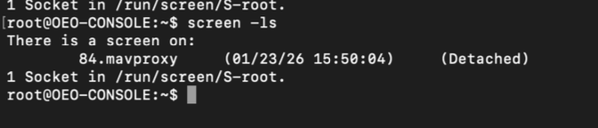 </p>

You should see the mavproxy session already running. This session manages communication with the drone's autopilot.

### 5.3.3 Start the Experiment

From the OEO Console, start the AERPAW experiment:

```bash
./startOEOConsole.sh
```

Then execute:

```bash
all start_experiment
```

<p align="center"> 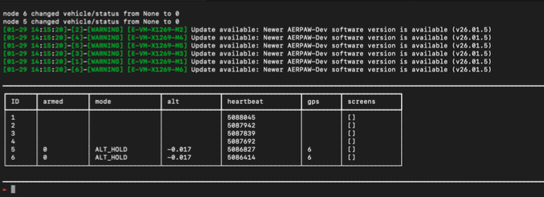 </p>

This command starts the experiment scripts on all allocated nodes. You should see confirmation that the vehicle script has been activated on the drone.

## 5.4 Pre-Flight Procedures

### 5.4.1 Check Drone Status in QGroundControl

In QGroundControl, verify:

* Connection status shows "Ready to Fly"
* GPS has adequate satellite lock (10+ satellites)
* Battery voltage is sufficient
* Home position is set correctly

<p align="center"> 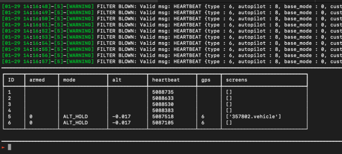 </p>

### 5.4.2 Set Flight Mode to GUIDED

From the OEO Console, set the drone to GUIDED mode:

```bash
5 set_mode GUIDED
```

<p align="center"> 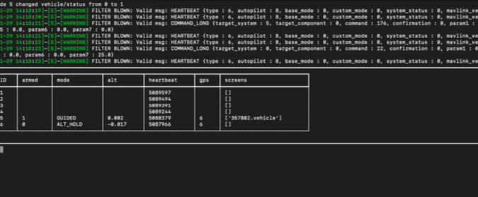 </p>

### 5.4.3 Arm the Drone

Arm the drone's motors:

```bash
5 arm
```

<p align="center">  </p>

Verify in QGroundControl that the drone shows "Armed" status.

## 5.5 Scenario 1: Plaintext Command Vulnerability (Attack Succeeds)

In this scenario, you will demonstrate how unencrypted navigation commands can be exploited for path spoofing attacks.

### 5.5.1 Start the Receiver on the Drone

SSH into the drone and start the receiver in listening mode:

```bash
ssh -i ~/.ssh/aerpaw_id_rsa root@192.168.144.5
cd /root
env -u OPENSSL_CONF -u OPENSSL_MODULES -u OPENSSL_ENGINES python3 receiver_v2.py \
  --listen 0.0.0.0 \
  --port 14551 \
  --aes-key ./mavlink_aes256.key \
  --hmac-key ./mavlink_hmac.key
```

<p align="center"> 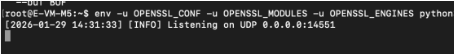 </p>

The receiver will begin listening for navigation commands on UDP port 14551.

### 5.5.2 Observe Initial Flight

Watch the drone in QGroundControl as it:

1. Takes off to 25 meters altitude
2. Flies to BS1 (first waypoint)
3. Dwells for the configured time
4. Proceeds toward BS2

<p align="center">  </p>

### 5.5.3 Send Plaintext Command from Base Station

When the drone is approaching or has reached BS2, SSH into the base station and send a plaintext navigation command:

```bash
ssh -i ~/.ssh/aerpaw_id_rsa root@192.168.144.1
cd /root
env -u OPENSSL_CONF -u OPENSSL_MODULES -u OPENSSL_ENGINES python3 sender_v2.py \
  --mode plain \
  --cmd goto \
  --lat 35.7302614 \
  --lon -78.69866117 \
  --alt 25
```

<p align="center">  </p>

### 5.5.4 Observe Spoofing Behavior

Monitor QGroundControl to observe:

1. The receiver detects the plaintext command
2. The drone deviates 90 meters east from the intended path
3. The drone enters a holding pattern at the spoofed location

<p align="center"> 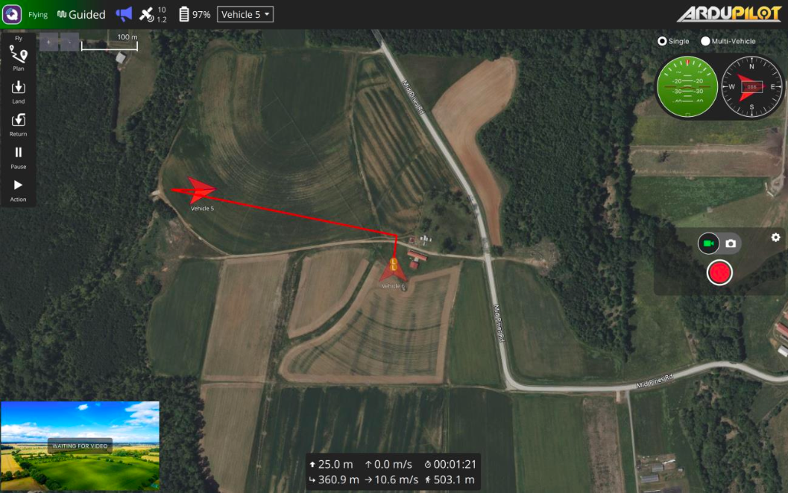 </p>

This demonstrates a successful path spoofing attack due to lack of encryption.

### 5.5.5 Send Encrypted Override (Optional)

To demonstrate recovery, send an encrypted command:

```bash
env -u OPENSSL_CONF -u OPENSSL_MODULES -u OPENSSL_ENGINES python3 sender_v2.py \
  --mode enc \
  --cmd goto \
  --lat 35.7302614 \
  --lon -78.69866117 \
  --alt 25
```

<p align="center"> 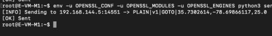 </p>

The drone should:

1. Detect the encrypted command within the 30-second window
2. Immediately return to launch position
3. Land safely

### 5.5.6 Review Telemetry Logs

After the drone lands, review the flight logs:

```bash
cd /root/Results
ls -lt *.txt | head -1
cat <most_recent_log_file>
```

<p align="center">  </p>

The logs will show:

* Timestamp of plaintext command detection
* State transition to spoofed waypoint
* Position data confirming the deviation
* Encrypted command detection (if override was sent)
* Return to launch behavior

## 5.6 Scenario 2: Encrypted Command Protection (Attack Prevented)

In this scenario, you will demonstrate how encryption prevents path spoofing attacks.

### 5.6.1 Reset the Experiment

If continuing from Scenario 1, reset the experiment:

1. Stop all running scripts (Ctrl+C on receiver)
2. Clear the command file:

```bash
rm /tmp/flight_cmd.txt
```

3. Ensure the drone is landed and disarmed
4. Restart the experiment via OEO Console

### 5.6.2 Restart Receiver

Restart the receiver on the drone:

```bash
env -u OPENSSL_CONF -u OPENSSL_MODULES -u OPENSSL_ENGINES python3 receiver_v2.py \
  --listen 0.0.0.0 \
  --port 14551 \
  --aes-key ./mavlink_aes256.key \
  --hmac-key ./mavlink_hmac.key
```

### 5.6.3 Arm and Begin Flight

From OEO Console:

```bash
5 set_mode GUIDED
5 arm
```

Observe the drone takeoff and begin its mission.

### 5.6.4 Send Encrypted Command at BS2

When the drone approaches BS2, send an encrypted command from the base station:

```bash
env -u OPENSSL_CONF -u OPENSSL_MODULES -u OPENSSL_ENGINES python3 sender_v2.py \
  --mode enc \
  --cmd goto \
  --lat 35.7302614 \
  --lon -78.69866117 \
  --alt 25
```

### 5.6.5 Observe Defense Behavior

Monitor QGroundControl to observe:

1. The receiver successfully decrypts the command
2. The drone does NOT deviate from the intended path
3. The drone immediately returns to launch position
4. The drone lands safely

<p align="center"> 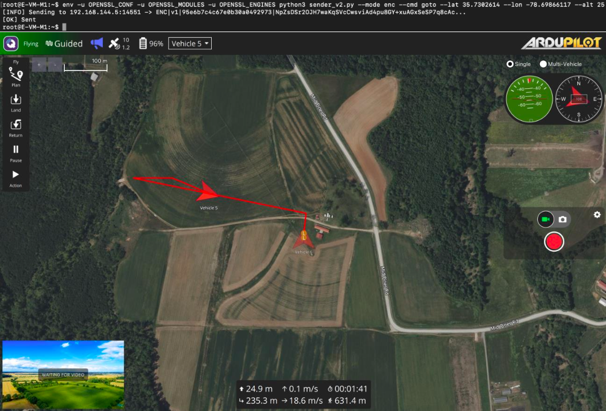 </p>

This demonstrates successful prevention of the path spoofing attack through encryption.

<p align="center">  </p>

### 5.6.6 Review Defense Logs

Examine the flight logs:

```bash
cd /root/Results
cat <most_recent_log_file>
```

<p align="center"> 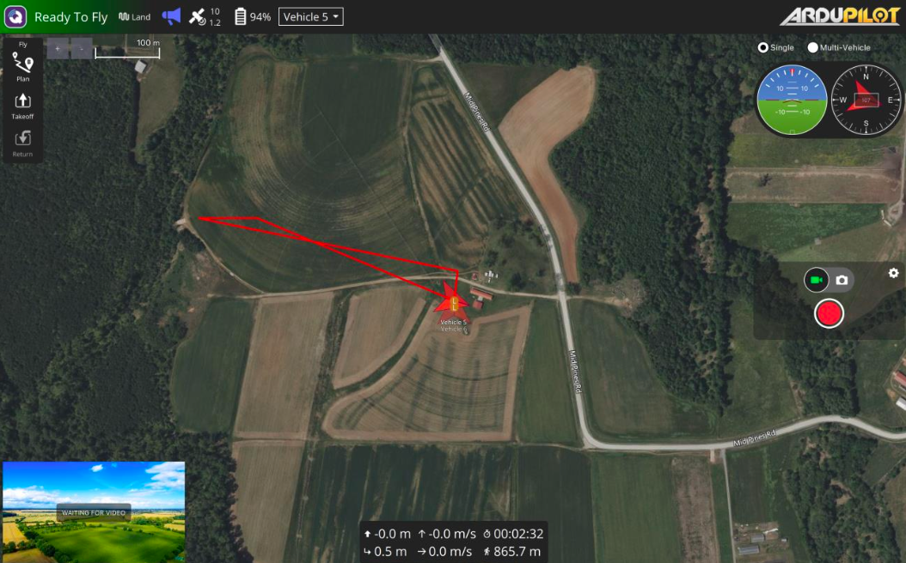 </p>

The logs will show:

* Timestamp of encrypted command detection
* No deviation to spoofed waypoint
* Direct return to launch behavior
* Successful landing

## 5.7 Analysis and Observations

<p align="center">  </p>

* During this whole process, at the drone’s end we see plaintext and encrypted messages
being parsed

<p align="center"> 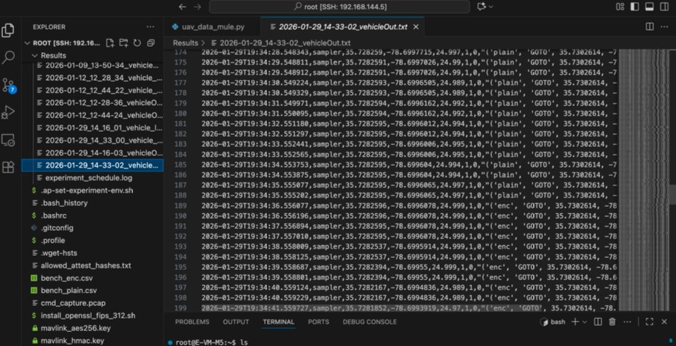 </p>

* And also we can see telemetry logs as

<p align="center"> 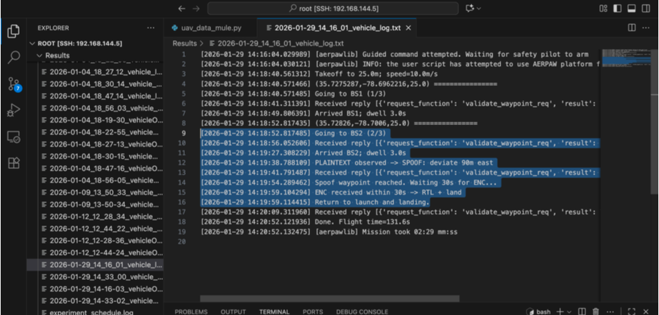 </p>


### 5.7.1 Comparing Attack and Defense Scenarios

Compare the outcomes of plaintext versus encrypted command scenarios in terms of command reception, spoof detection, flight behavior, mission outcome, and security level.

### 5.7.2 Understanding the Security Improvement

The experiment demonstrates key security principles including confidentiality, integrity, attack prevention, and defense-in-depth.

### 5.7.3 Real-World Implications

In operational UAV systems, path spoofing could lead to mission failure, unauthorized activities, physical damage, regulatory violations, and safety risks. Cryptographic protection is essential for security-critical applications.

## 5.8 Post-Experiment Procedures

### 5.8.1 Stop All Scripts

Terminate all running experiment scripts.

### 5.8.2 Collect and Archive Data

Gather all experimental data:

```bash
# On the drone
cd /root/Results
tar -czf experiment_results_$(date +%Y%m%d_%H%M%S).tar.gz *.txt *.csv

# Download to local machine
scp -i ~/.ssh/aerpaw_id_rsa root@192.168.144.5:/root/Results/experiment_results_*.tar.gz ./
```

### 5.8.3 Clean Up Temporary Files

Remove temporary command files:

```bash
rm /tmp/flight_cmd.txt
```

### 5.8.4 Release AERPAW Resources

Release allocated nodes through the AERPAW portal.

## 5.9 Troubleshooting

Common issues and solutions for drone not taking off, receiver not detecting commands, unexpected deviations, and decryption failures.

## 5.10 As a Result

As a result of completing this chapter, you have successfully executed a comprehensive path spoofing attack and defense experiment on a UAV system. You demonstrated how plaintext navigation commands are vulnerable to spoofing attacks that can divert the drone from its intended path. You then showed how FIPS-validated cryptographic protection prevents these attacks, ensuring the drone follows only authenticated commands from authorized ground control stations.

Through hands-on experimentation, you observed the dramatic difference between vulnerable and secure systems. You gained practical experience with cryptographic key management, secure command protocols, and the real-world implications of UAV security. This experiment provides a foundation for understanding how cryptography protects autonomous systems from adversarial manipulation.

The principles demonstrated in this lab—confidentiality, integrity, authentication, and defense-in-depth—apply broadly to all command and control systems. By mastering these concepts in the controlled AERPAW environment, you are prepared to implement security solutions for real-world autonomous systems.