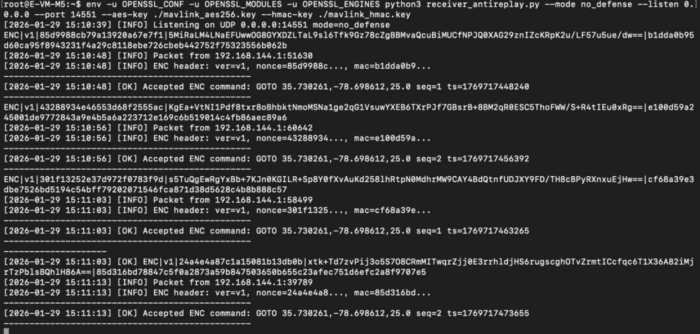
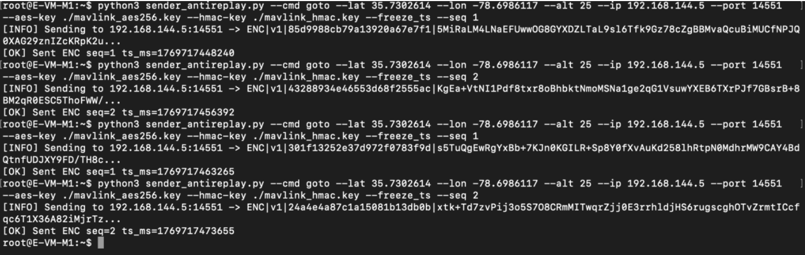
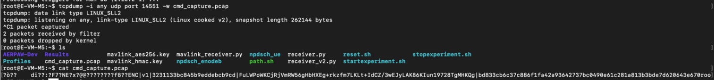
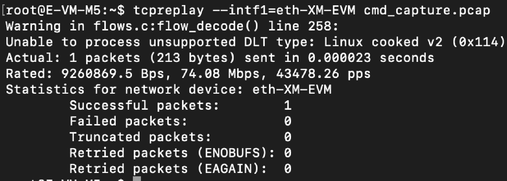
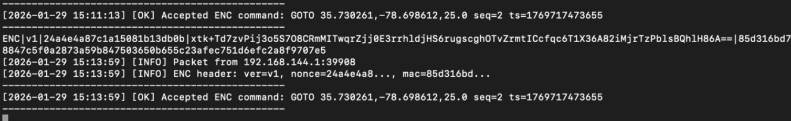
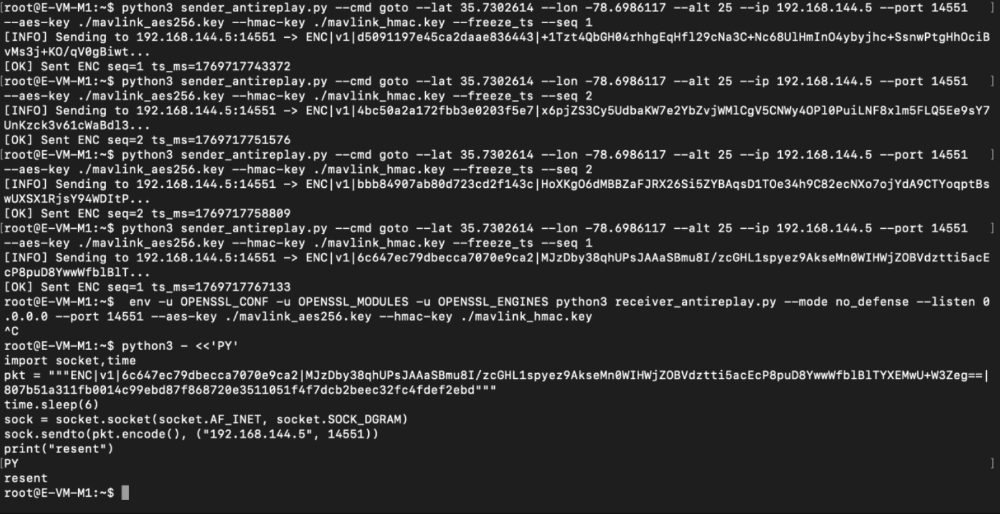
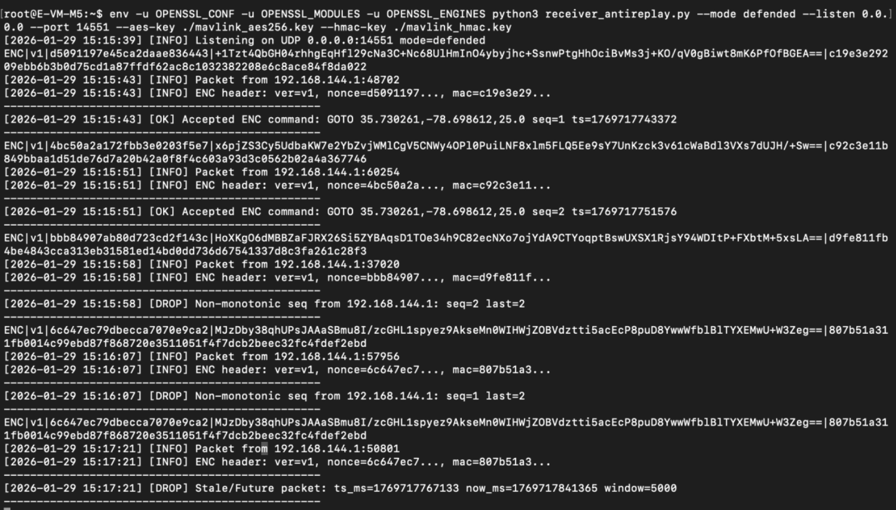

# Chapter 2 — AERPAW User Setup and Instance Preparation

## 2.1 Overview

In this chapter, you will perform a replay attack experiment on encrypted UAV navigation commands and evaluate the effectiveness of anti-replay defenses.

Encrypted MAVLink commands are transmitted from the base station to the drone using AES-256-GCM and HMAC-SHA256. An adversary can capture these packets and replay them later to disrupt mission execution.

This chapter demonstrates system behavior in two modes:

* No-defense mode, where replayed packets are accepted
* Defended mode, where replayed packets are rejected

By completing this chapter, you will be able to reproduce and analyze replay attacks in the AERPAW environment.

## 2.2 Prerequisites and Environment Setup

Before starting this experiment, ensure that:

* A PC or laptop with a supported operating system (Linux recommended; Windows or macOS also supported)
* Reliable internet connectivity
* You have access to an active AERPAW experiment session
* The drone and base station nodes are allocated
* SSH access to both nodes is available
* AES and HMAC keys are generated and shared
* QGroundControl is installed and configured
* Active OpenVPN connection

This chapter assumes that basic AERPAW user registration and VPN setup have already been completed.

## 2.3 Network and System Configuration

### 2.3.1 Network Roles

This experiment uses the following components:

* Base Station (GCS): Sends encrypted navigation commands
* Drone: Receives and executes commands
* Adversary (optional): Captures and replays packets

All MAVLink communication uses UDP port 14551.

### 2.3.2 Required Files

Ensure that the following files are present on both the base station and the drone:

sender_antireplay.py
receiver_antireplay.py
mavlink_aes256.key
mavlink_hmac.key

### 2.3.3 Starting the Receiver

On the drone node, start the receiver in no-defense mode:

```bash
python3 receiver_antireplay.py \
--mode no_defense \
--listen 0.0.0.0 \
--port 14551 \
--aes-key mavlink_aes256.key \
--hmac-key mavlink_hmac.key
```

Keep this terminal running during the experiment.

<p align="center">  </p>

The receiver starts listening for encrypted MAVLink commands and accepts all incoming packets without freshness validation.

### 2.3.4 Sending Encrypted Commands

On the base station, send encrypted navigation commands:

```bash
python3 sender_antireplay.py \
--cmd goto \
--lat <latitude> \
--lon <longitude> \
--alt 25 \
--ip <drone_ip> \
--port 14551 \
--aes-key mavlink_aes256.key \
--hmac-key mavlink_hmac.key \
--freeze_ts --seq 1
```

This command generates encrypted MAVLink traffic for capture.

<p align="center">  </p>

This command generates encrypted MAVLink traffic that can later be captured and replayed.

## 2.4 Replay Attack Without Protection

In this scenario, the drone does not enforce freshness checks on incoming commands.

### 2.4.1 Run the simulation and capture valid encrypted traffic

First, run the simulation and allow the base station to send a valid encrypted navigation command.

Start packet capture on the monitoring or adversary node:

```bash
tcpdump -i any udp port 14551 -w cmd_capture.pcap
```

<p align="center">  </p>

Allow normal encrypted command traffic to occur while capture is running, then stop capture using Ctrl+C.

### 2.4.2 Replay the captured command during a later phase of the mission

Replay the captured traffic:

```bash
tcpreplay --intf1=<interface> cmd_capture.pcap
```

<p align="center">  </p>

Replace <interface> with your active interface (example: eth0)

### 2.4.3 Expected system behavior (no protection)

Because the command is encrypted but not checked for freshness, the drone accepts the replayed command and executes it again.

This behavior demonstrates how replay attacks can succeed even when encryption is used, as long as the system does not verify whether a command is new or duplicated.

<p align="center">  </p>

The drone executes the replayed command, demonstrating a successful replay attack.

## 2.5 Replay Attack With Protection Enabled

In this scenario, replay protection mechanisms are enabled on the drone receiver.

## 2.5.1 Restart the receiver with freshness validation enabled

Stop the previous receiver using Ctrl+C.

Restart the receiver in defended mode:

```bash
python3 receiver_antireplay.py \
--mode defended \
--listen 0.0.0.0 \
--port 14551 \
--aes-key mavlink_aes256.key \
--hmac-key mavlink_hmac.key
```

## 2.5.2 Attempt to replay the captured command

Replay the captured traffic again:

```bash
tcpreplay --intf1=<interface> cmd_capture_defended.pcap
```

<p align="center">  </p>

This represents a replay attempt under defended conditions.

## 2.5.3 Expected system behavior (protection enabled)

The drone rejects the replayed message because it detects that the command is stale, duplicated, or outside the allowed freshness window.

This behavior demonstrates how replay protection prevents attackers from reusing previously valid commands.

<p align="center">  </p>

The drone ignores stale or duplicated packets, preventing the attack.

## 2.6 Analysis and Observations

Compare the outcomes of the two scenarios.

* In no-defense mode, previously captured encrypted commands can be replayed and accepted by the drone, leading to unintended behavior.

* In defended mode, the same commands are rejected when replay protection is enabled, preserving mission integrity.

This experiment highlights that encryption alone does not prevent replay attacks and that freshness validation is required to ensure command authenticity over time.

## 2.7 As a Result

As a result of completing this chapter, you observed how replay attacks exploit the absence of freshness checks in encrypted communication. You were able to view that when replay protection is disabled, previously captured encrypted commands can be reused and accepted by the drone, leading to unintended behavior. When replay protection mechanisms are enabled, the same commands are correctly rejected, preserving mission integrity. Through this experiment, you gained practical insight into why secure systems must verify not only who sent a command, but also when it was sent.